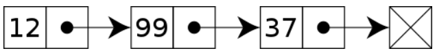
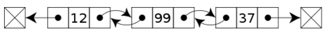

# LinkedList (연결 리스트)

---

#### 각 노드가 데이터와 다음 노드를 가리키는 링크(참조)로 이루어진 자료구조

### Node
- 데이터를 저장하고 다음 노드를 가리키는 링크로 구성된 기본 단위
- 데이터 필드
  - 노드가 저장하는 실제 데이터
  - 노드가 저장하는 값이나 객체 등을 나타낸다.
- 링크 필드
  - 다음 노드를 가리키는 참조를 포함
  - 단일 연결 리스트에서는 다음 노드를 가리키는 링크만 있고,
  - 이중 연결 리스트에서는 이전 노드와 다음 노드를 가리키는 두 개의 링크가 있다.
```java
class Node {
    // 데이터 필드
    int data;
    // 링크 필드 (다음 노드를 가리키는 참조)
    Node next;

    // 생성자
    public Node(int data) {
        this.data = data;
        this.next = null; // 초기에는 다음 노드가 없으므로 null로 초기화
    }
}
```

### Singly Linked List (단일 연결 리스트)
각 노드가 데이터와 다음 노드를 가리키는 링크로 이루어져 있다.


### Doubly Linked List (이중 연결 리스트) 
각 노드가 데이터, 이전 노드를 가리키는 링크, 다음 노드를 가리키는 링크로 이루어져 있다.


---

## 장단점

### + 동적 크기
- 연결 리스트는 동적으로 크기를 조절할 수 있다.
- 런타임에 메모리를 할당하고 해제할 수 있다.
- 동적 메모리 할당이라고 한다.

### + 삽입, 삭제
- 특정 위치에 노드를 추가하거나 삭제하는 연산이 효율적이다.
- 특정 위치의 노드에 직접 `접근`하는 데 O(n)의 시간 복잡도(선형)를 가진다.
  - 처음부터 순차적으로 검색하기 때문
- 노드를 `삽입, 삭제`하는 데 O(1)의 시간 복잡도(상수)를 가진다.
  - 중간 삽입 없이 맨 앞과 맨 뒤에만 삽입한다면 O(1)의 시간 복잡도를 갖는다.
  - 그렇지 않다면 삽입할 위치를 찾고 삽입 연산을 진행하기 때문에 O(n)의 시간 복잡도를 가진다.

### + 메모리 효율성
- 각 노드가 독립적으로 메모리에 할당되기 때문에 동적으로 크기를 조절할 수 있다.
  - Array의 경우, 데이터를 삽입하여 모든 공간이 꽉 차게 되면 새로운 메모리 공간을 할당받아 옮겨야 하지만, 
  - LinkedList는 추가할 때마다 동적으로 메모리 공간을 할당받는다.

### - 접근 속도
- 특정 위치의 노드에 접근하려면 처음부터 순차적으로 찾아가야 한다.
- 특정 인덱스에 빠르게 접근하는 것이 배열보다 느리다.

### - 추가 메모리 사용
- 각 노드에는 데이터와 링크를 위한 추가적인 메모리가 필요하다.
- 연결 리스트는 각 노드를 따라가야 하므로 메모리 사용이 더 많을 수 있다.

<blockquote>
연결 리스트는 삽입과 삭제가 빈번한 상황에서 효율적으로 사용된다.
</blockquote>
