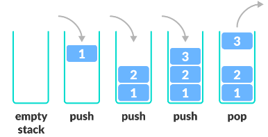
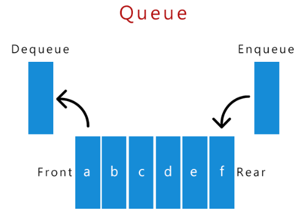

# Stack과 Queue

---

## Stack
가장 마지막으로 들어간 데이터가 가장 첫 번 째로 나오는 성질을 가진 자료 구조
- LIFO(Last in First Out) 구조
- 삽입 및 삭제에 O(1), 탐색에 O(n)의 시간 복잡도를 가진다.
- 한 쪽 방향에만 자료를 추가, 삭제 할 수 있으며 가장 마지막에 삽입된 자료의 위치를 `top`이라 한다.
  - Stakc은 `top`에만 접근이 가능하기 때문에 그 외의 위치에 대한 데이터 추가 및 삭제가 불가능하다.
- 웹 브라우저 방문 기록, 실행 취소, 역순 문자열 만들기, 후위 표기법 계산 등에 쓰인다.
- Push : 데이터를 스택의 맨 위에 추가.
- Pop : 스택의 맨 위에 있는 데이터를 제거.

### + 장점
- top 위치의 데이터에 바로 접근하므로 데이터 삽입, 삭제의 시간 복잡도가 O(1)로 빠르다.

### - 단점
- 후입선출 구조이기 때문에 특정 위치의 데이터에 랜텀 엑세스가 어렵다.
- 특정 위치의 데이터에 바로 접근하려면 맨위에서부터 차례로 pop하는 방식을 사용해야 한다.

---

## Queue
먼저 들어간 원소가 먼저 나오는 구조이다.
- FIFO(First in First out) 구조
- 한 쪽에서 삽입, 반대 쪽에서 삭제가 이루어진다.
  - 삽입이 이루어지는 쪽을 `rear`, 데이터가 삭제되는 쪽을 `front`라고 한다.
- 대기열, 버퍼, 작업 스케줄링 등에 사용된다.
- 큐의 활용분야로 안드로이드의 경우, 루퍼의 메시지 큐가 예시 중 하나이다.
- Enqueue(삽입) : 큐의 뒤쪽(마지막)에 요소를 추가
- Dequeue(제거) : 큐의 앞쪽(첫 번째)에서 요소를 제거

### + 장점
- front 위치의 데이터에 바로 접근하므로 데이터 삽입, 삭제의 시간 복잡도가 O(1)로 빠르다.

### - 단점
- 큐 역시 front가 아닌 중간에 위치한 데이터 접근이 불가능하다.
- Queue를 일반 Array로 구현하면 dequeue의 시간복잡도가 O(n)로 느리다.
  - 이로 인해 사용되지 않는 메모리가 낭비될 수 있다.