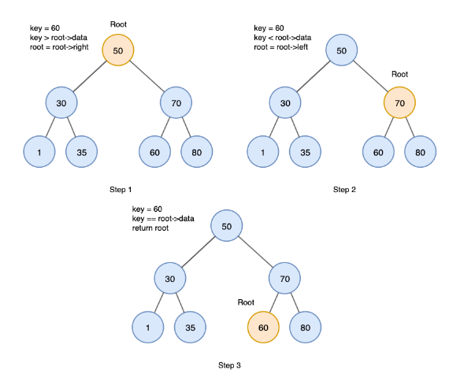

# 이진 탐색 트리 BST(Binary Search Tree)

---

각 노드의 자식노드가 최대 2개인 이진트리에 여러 조건이 붙은 트리

### 이진 탐색 트리의 목적
이진 탐색 + 연결리스트
- 이진 탐색
  - 탐색에 소요되는 시간 복잡도 O(log n)
  - 삽입, 삭제 불가능
- 연결리스트
  - 삽입, 삭제의 시간 복잡도 O(1)
  - 탐색하는 시간 복잡도 0(n)
- 이진 탐색과 연결리스트의 장점을 모두 얻기 위해 고안된 것이 `이진 탐색 트리`
- 효율적인 탐색 능력을 가지고 자료의 삽입, 삭제도 가능하게 만드는 것이 목적.

### 특징
- 모든 원소의 키는 유일한 키를 가진다. (중복되지 않는 키)
- 루트 노드의 왼쪽 서브트리에 있는 모든 노드의 값은 루트 노드의 값보다 작아야 한다.
- 루트 노드의 오른쪽 서브 트리는 루트 노드의 값보다 커야 한다.
- 왼쪽, 오른쪽 서브 트리 모두 이진 탐색 트리여야 한다.

### BST 핵심 연산

#### 1. 탐색
- 루트 노드의 키와 찾고자 하는 값 비교(루트 노드가 그 값이라면 탐색 종료)
- 찾고자 하는 값이 루트 노드보다 작다면 왼쪽 서브 트리로 탐색 진행
- 찾고자 하는 값이 루트 노드보다 크다면 오른쪽 서브 트리로 탐색 진행

#### 2. 삽입
- 삽입을 위해서 먼저 탐색을 수행해야 한다.
  - 같은 키값을 갖는 노드가 없어야 하고
  - 탐색에 실패한 위치가 새로운 노드를 삽입하는 위치가 되기 때문
- 루트 노드부터 값을 비교하면서 삽입

#### 3. 삭제
- 삭제할 노드가 리프 노드인 경우
  - 해당 노드를 삭제하고, 부모 노드에서 해당 노드의 참조를 null로 설정.
- 삭제할 노드가 자식을 한 개 가지고 있을 경우
  - 해당 노드를 삭제하고, 부모 노드와 삭제된 노드의 자식을 연결한다.

- 삭제할 노드가 자식을 두 개 가지고 있을 경우
  - 삭제할 노드의 오른쪽 서브트리에서 가장 작은 값을 가진 노드(또는 왼쪽 서브트리에서 가장 큰 값을 가진 노드)를 찾는다.
  - 찾은 노드를 삭제 대상 노드와 교체한다.

