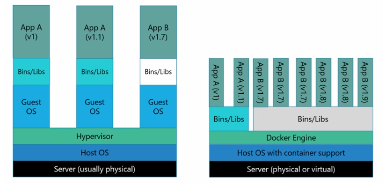

# Docker

---

- Go 언어로 작성된 리눅스 컨테이너 기반으로 하는 오픈소스 가상화 플랫폼
- 리눅스 컨테이너에 리눅스 애플리케이션을 프로세스 격리기술을 사용하여 더 쉽게 컨테이너로 실행하고 관리할 수 있게 해주는 오픈소스 프로젝트이다.
- 기존 컨테이너 기술은 리눅스 운영체제 기술이다.
- Docker 위에서 동작하는 컨테이너, 그리고 컨테이너 안에서 동작하는 앱들은 리눅스 운영체제에서 동작한다.
- 만약 리눅스가 아닌 Window, Mac OS 라면 VM을 설치 후 그 위에 리눅스 OS를 설치한다면 Docker와 같은 컨테이너 기술을 사용할 수 있다.
  - OS 위에 OS가 실행되기 때문에 성능 문제가 있다.
- Docker를 사용한다면 위의 과정을 알아서 해결해준다.

### 가상화 플랫폼 - VM(가상머신)
- 가상 머신은 실제 컴퓨터의 가상 표현, 애뮬레이션
  - 이를 게스트라 하며, 실행하는 실제 시스템을 호스트라 한다.
- 하나의 물리적 시스템에서 각각 자체 운영 체제와 애플리케이션을 지닌 다수의 가사 머신을 만들 수 있다.
- VM은 실제 컴퓨터와 직접 상호작용할 수 없다. 기본적인 하드웨어 간의 조정을 위해 하이퍼바이저라 하는 경량 SW 계층이 필요하다.
  - 하이퍼바이저 : OS의 여러 인스턴스가 동일한 물리적 컴퓨팅 리소스를 공유하여 동시에 실행될 수 있게 하는 경량 SW 계층

### 컨테이너
- 가상화 기술 중 하나로 대표적으로 LXC(Linux Container)가 있다.
- 기존 OS를 가상화 시키던 것과 달리 컨테이너는 `OS레벨의 가상화로 프로세스를 격리시켜 동작하는 방식`
- VM은 한 서버의 여러 OS를 가상화 하여 사용하지만, 컨테이너는 프로세스를 격리시켜 동작한다.

### VM vs Docker

**Vm**
- Host OS 위에 가상화를 시키기 위한 Hypervisor 엔진 그리고 위에 Guest OS를 올려 사용.
- Host OS 와 완전 히 분리되는 장점이 있지만 OS 위에 OS를 올리기 때문에 무겁고 느릴수밖에 없다.
- 하지만 컨테이너 기반 가상화보다 더 높은 격리 레벨을 지원하는데, 이는 보안적인 측면에서 더욱 유리하다.
- 그리고 커널을 공유하지 않는데, 커널을 공유하지 않는 만큼 멀티 OS가 가능하다.

**Docker**
- Docker 엔진 위에 애플리케이션 실행에 필요한 바이너리만 올라간다.
- Host OS, Docker 엔진 위에서 바로 동작하며 Host의 커널을 공유하는데,
- 커널을 공유하게 되면 IO 처리가 쉽게 되어 성능에 좋다.
- 컨테이너를 사용하는 것은 VM 을 생성하는 것이 아니라 Host OS가 사용하는 자원을 분리하여 여러 환경을 만들 수 있도록 하는 것이다.
- 기존 VM보다 보안 수준이 떨어지는 것은 사실이나 그럼에도 Docker를 쓰는 이유는
- 성능향상, 뛰어난 이식성, 쉽게 Scale Out을 할 수 있는 유연성이 있기 때문이다.
