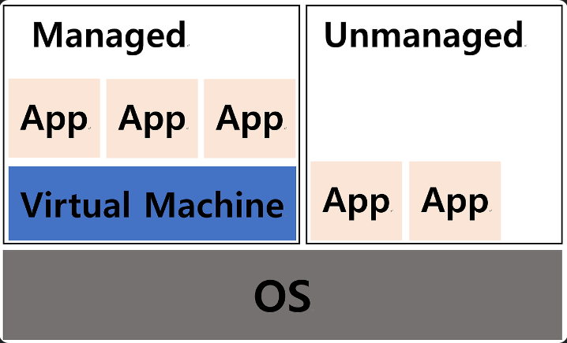
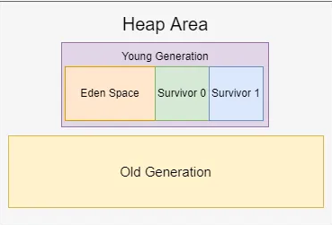

# Java

---

### Managed - Unmanaged 언어의 차이는 무엇이고 어떤 장, 단점이 있나요?
**Managed**
- Managed 언어는 런타임 환경 내에서 프로그램을 생성하도록 설계된 언어.
- OS 위에 VM을 두어 소스코드를 컴파일 하는 과정은 VM 위에서 이루어진다.
- Java는 Managed 언어이다.

**Unmanaged**
- Unmanaged 언어는 반대로 런타임 환경의 관리를 받지 않는 언어
- C, C++
> 런타임 환경 : 애플리케이션이 OS의 시스템 자원에 액세스할 수 있도록 해주는 실행 환경(VM)

### Java 접근 제어자에는 무엇이 있는지 설명해주시고 Protect와 Private는 어느 시점에 어떻게 사용될 수 있는지 이야기 해주세요.
- public, default, private, protect
- private은 같은 클래스 내에서만 접근이 가능하다
  - 클래스 내부 구현을 숨기고 외부에서 접근하지 못하도록 캡슐화할 때 사용된다.
  - private을 사용하여 객체의 상태를 보호하고 데이터 수정을 방지할 수 있다.
- protect는 같은 패키지 내의 클래스와 클래스를 상속받은 하위 클래스에서 접근이 가능하다.
- default는 같은 패키지 내의 다른 클래스들에서 접근할 수 있다.
  - 접근 제어자를 명시하지 않은 경우에 적용된다.

### JVM의 메모리 구조에 대해서 설명해 주세요.
- Runtime Data area의 메모리 영역을 의미
- Method Area : 로드된 클래스의 메타데이터(클래스 이름, 부모 클래스 이름, 메서드, 변수)를 저장
  - static 변수, 상수, 메서드 코드가 저장
    - JDK7까지 static 변수들은 Method Area에 저장되었지만 JDK8부터는 Heap Area로 이동
    - 따라서 static 변수도 GC의 대상이다.
  - 모든 스레드가 공유되는 영역
- Heap Area : 모든 객체의 인스턴스와 배열이 저장된다.
  - GC가 관리
  - 모든 스레드가 공유되는 영역
- Stack Area : 메서드 호출 시마다 프레임(해당 메서드만을 위한 공간)이 생성된다.
  - 호출된 메서드의 매개변수, 지역변수 등을 임시로 저장
  - 메서드 수행이 끝나면 프레임을 삭제한다.
  - 각 스레드마다 [별도로 할당](src/main/java/org/example/Operating%20System/프로세스&%20스레드.md) 되는 메모리 공간
- PC Register : 스레드가 시작될 때 생성되며, 각 스레드마다 하나씩 존재한다.
  - 쓰레드의 문맥 교환(Context Switch) 시 정확한 실행 위치를 유지한다
  - 현재 수행중인 JVM 명령의 주소를 갖는다.
- Native method stack : 자바 외 언어로 작성된 네이티브 코드를 위한 메모리 영역

### JVM은 어떤 방식으로 코드를 해석하고 실행시키는지 흐름에 맞게 설명해 주세요. (Java 실행 흐름)
- 자바 컴파일러(javac)
  - 자바 소스 파일을 바이트코드 파일인 class 파일로 변환
  - 바이트코드는 JVM이 이해할 수 있는 명령어들로 구성된다.
- Class Loader
  - 필요한 클래스를 로딩해서 메모리에 올린다.
  - 런타임 시에 동적으로 클래스를 로드한다.
- Runtime Data Area
  - Jvm 메모리 영역으로 자바 애플리케이션을 실행할 때 사용되는 데이터를 적재하는 영역
  - 메모리를 할당 받아 관리하는 영역
  - Method Area, Heap Area, Stack Area, PC Register, Native Method Stack
- Execution Engine
  - Class Loader를 통해 Runtime Data Area에 배치된 바이트 코드들을 명령어 단위로 읽어서 실행
  - 메모리에 로딩된 코드를 해석
  - 인터프리터 : 바이트코드를 한 줄씩 읽고 실행, 하지만 반복문 등에서 비효율적이다.
  - JIT 컴파일러 : 자주 실행되는 바이트코드 부분을 네이티브 코드로 변환하여 성능을 향상
- Garbage Collector
  - Heap 메모리 영역에 생성된 객체들 중에서 참조되지 않은 객체를 탐색해 제거.

### Garbage Collector은 무엇인가요?
- Heap 메모리 영역에서 참조되지 않은 객체를 제거
- Heap 영역 -> Young Generation의 Eden영역, Survivor영역(S0,S1)
- 객체가 생성되면 Eden 영역에 저장된다.
- 객체가 쌓여 Eden 영역이 차게되면 GC가 실행되는데 mark-sweep-compact 방식으로 실행된다.
  - mark : 살아있는 객체를 찾아 마킹
  - sweep : 참조하고 있지 않은 쓰레기 객체를 Heap에서 제거
  - compact : 살아있는 객체들을 한 곳으로 모은다.
- Eden 영역에서 살아남은 객체들은 Survivor 영역에 이동한다.
  - 살아남은 객체의 age가 1씩 증가
- age가 기준(jdk의 경우 31)만큼 커지면 Old Generation으로 이동된다.

### GC가 자주 발생된다면 어떤 문제가 있을까요?
- STW(Stop The World) : GC가 작동되는 동안에는 모든 애플리케이션 스레드가 중단
  - 응답시간 지연
- 불필요한 객체를 만들어내는 상황을 줄이자!

### Java는 Call By Value일까요, Call By Reference 일까요?
- Java는 기본적으로 Call By Value이다.
- 객체 참조 변수를 메서드 인자로 전달할 때 메서드에서 객체의 필드 값은 변경할 수 있지만 객체 자체를 변경할 수는 없다.
  - 객체 참조 변수의 메모리 주소를 복사해서 전달하기 때문
- Call By Value : 함수에 값을 전달할 때 값을 복사하여 전달하는 방식
  - 원본 데이터를 보호할 수 있는 장점이 있지만, 큰 데이터의 경우 메모리 사용량이 높다
- Call By Reference : 함수에 값을 전달할 때 메모리 주소를 전달하는 방식
  - Call By Value와는 반대의 성향을 가지고 있다.

### Shallow Copy와 Deep Copy의 차이는 무엇인가요? 자바에서 Deep Copy를 하기 위해서는 무엇을 사용하여야 하나요?

### Java Reflection이란 무엇이고, 어떨 때 사용되는 것인가요?

### Java Stream API의 특징은 무엇이 있나요?

### iterator와 iterable 차이는 무엇인가요?

### 자바의 synchronized 키워드에 대해 설명해주시고 Reentrant Lock와의 차이는 무엇인지 말씀해주세요.

### Java의 synchronized Lock 범위에 대해서 알려주세요. (Class Lock, Instance Lock)

### volatile 키워드에 대해 설명해 주세요.

### atomic Type과 CAS는 무엇이고 언제 사용되는 것인가요?

### Java final 키워드에 대해서 설명해주세요. 각각의 쓰임에 따라 어떻게 동작하나요? (Class, Variable)

### 불변 객체는 무엇이고 Java에서 어떻게 구현할까요? 

### String이 final인 이유는 무엇인가요?

### 객체 지향의 클래스, 객체, 인스턴스 차이에 대해서 설명해 주세요.

### Interface와 Abstract Class의 차이는 무엇인가요?

### 문자열을 리터럴(string = "abcd")로 할당하는 것과 객체(string = new String("abcd"))로 할당하는 방식의 차이가 무엇인가요?

### Array와 ArrayList의 차이점, LinkedList와 ArrayList의 차이점

### HashMap에 대해서 설명

### ConcurrentHashMap은 어떤 방식으로 스레드 동시성을 보장하나요?