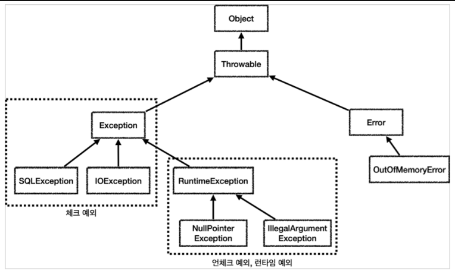

# 예외 처리

---

### 예외(Exception)과 오류(Error)
- 오류
  - 시스템이 종료되어야 할 수준의 수습할 수 없는 심각한 문제
  - 개발자가 미리 예측하여 방지할 수 없다.
- 예외
  - 개발자가 구현한 로직에서 발생한 실수나 사용자의 영향에 의해 발생
  - 오류와 달리 예측하여 방지할 수 있다.

### 예외 계층

- Throwable?
  - 오류나 예외에 대한 메시지를 담는 클래스
  - 예외가 연결될 때 연결된 예외의 정보들을 기록
  - getMessage(), printStackTrace()

### 예외 처리 방법
- 예외 복구 : 다른 작업 흐름으로 유도
```java
int maxretry = 10;
while (maxretry --> 0) {
    try {
        // 예외 발생 가능성 로직 실행
        return ; // 작업성공시 리턴
    } catch (CustomException e) {
        // 로그 출력, 일정 시간 대기
    } finally {
        리소스 반납
    }
}
throw new OtherException(); // 재시도 횟수 넘길 시 예외 발생
    
```
- 예외처리 회피 : 예외를 처리하지 않고 호출한 쪽으로 throw
```java
public void example() throws Exception{
    // ...
}
```
- 예외 전환 : 명확한 의미의 예외로 전환 후 throw
  - Checked Excpetion 중 복구 불가능한 예외가 잡혔다면 Unchecked Exception으로 전환
```java
public void example() {
    try {
        // 예외 발생 로직
    } catch(Exception e) {
        // 로그 출력
        throw new IllegalArgumentException();
    }
}
```
- 예외를 잡거나 던질 때 예외뿐만 아니라 그 예외의 자식들도 함께 처리할 수 있다.
- 예외를 처리하지 못하고 계속 던진다면?
  - 자바 main() 밖으로 예외를 던지면 예외 로그를 출력하면서 시스템이 종료됨.

### 검사 예외 (Checked Exception)
- 반드시 처리해야 하는 예외
- Exception을 상속받으며 Runtime Exception을 제외한 모든 예외
- 체크 예외는 잡아서 처리하거나(try/catch), 밖으로 던지는(throws) 등 명시적으로 처리해줘야 한다.

### 비검사 예외 (Unchecked Exception)
- Checked Excpetion 과는 달리 throws로 예외를 선언하지 않아도 된다.

### 예외 계층화
- 계층화 이전엔 오류 코드로 어떤 문제가 발생했는지 알 수 있었지만, 예외를 계층화함으로써 예외 그 자체로 어떤 오류가 발생했는지 알 수 있다.
- 계층화된 예외를 사용하여 각 예외마다 다른 로직을 실행할 수 있다.

### 리소스 반환
- try-catch-resource

```java
import java.io.*;

public class Ex {

  void example1(String path) throws IOException {
    try (BufferedReader br = new BufferedReader(new FileReader(path))) {
        // ...
    }
  }

  void example2(String src, String dst) throws IOException {
    try (InputStream in = new FileInputStream(src);
        OutputStream out = new FileOutputStream(dst)) {
        // ...
    }
  }

}
```