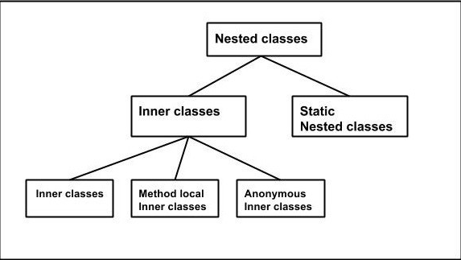

# 중첩 클래스

---

### 분류

- Static Nested Classes : 정적 중첩 클래스
- Inner Class : 내부 클래스
  - Local Class : 지역 클래스
  - Anonymous Class : 익명 클래스

내부 클래스(A) 안의 지역 클래스(b)와 익명 클래스(c)는 내부 클래스(A) 인스턴스에 소속되고, 정적 중첩 클래스는 내부 클래스와 전혀 다른 인스턴스를 가진다.