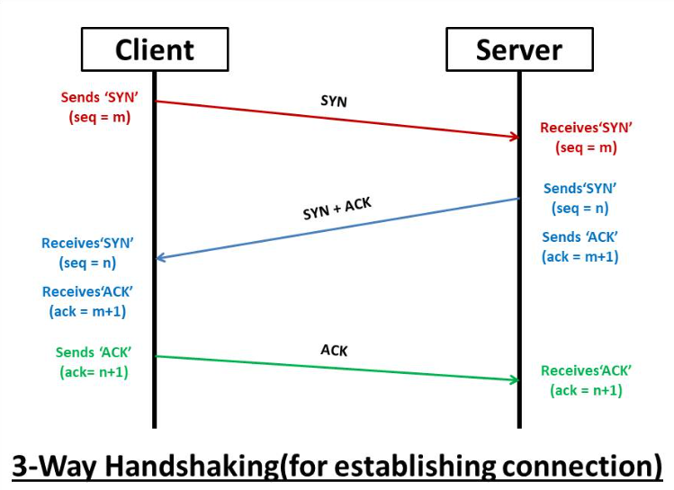

# 3-Way / 4-Way Handshake

---

## 3-way Handshake
TCP/IP 프로토콜을 이용해서 통신을 하는 응용 프로그램이 데이터를 전송하기 전에 먼저 정확한 전송을 보장하기 위해 상대방의 컴퓨터와 사전에 세션을 수립하는 과정을 의미.

### TCP 3-way Handshaking의 역할
양쪽 모두 데이터를 전송 할 준비가 되었다는 것을 보장하고, 실제로 데이터 전달을 시작하기 전에 한쪽이 다른 쪽에게 준비 되었다는 것을 알려주는 역할이다.

양쪽 모두 상대편에 대한 초기 순차일련번호를 얻을 수 있도록 한다.

<blockquote>
SYN(synchronized sequence numbers) : 다른 컴퓨터로 전송된 TCP 패킷으로 연결이 이루어지도록 요청  
ACK(Acknowledgment) : 승인의 약자로, 다른 컴퓨터에 요청을 보낸 것을 확인하는 응답을 나타낸다.  
</blockquote>

### 과정
- 클라이언트는 서버에 접속하는 SYN 패킷을 보낸다.
  - 클라이언트는 SYN을 보내고 SYN/ACK 응답을 기다리는 SYN_SEND 상태, 서버는 Wait for Client 상태이다.
- 서버는 SYN 요청을 받고 클라이언트에게 요청을 수락한다는 ACK와 SYN flag가 설정된 패킷을 발송.
  - 클라이언트가 다시 ACK로 응답하기를 기다린다. 이때 서버는 SYN_RECEIVE 상태가 된다.
- 클라이언트는 서버가 ACK를 보내고 이후로부터 연결이 이루어지고 데이터가 오간다.
  - 이때 서버는 Established(성립) 상태이다.
