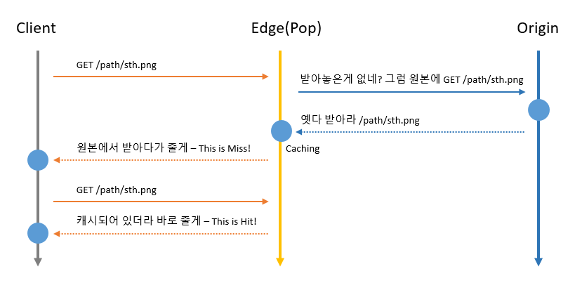
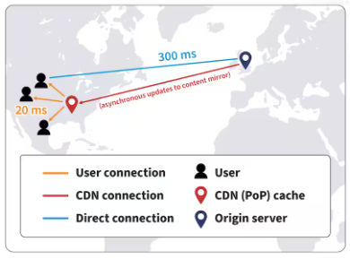

# CDN

---

- 콘텐츠 전송 네트워크의 약자로 웹 콘텐츠를 효율적으로 제공하기 위한 분산 네트워크.
- CDN은 웹 사이트의 정적 콘텐츠(이미지, css, js 파일 등)를 캐시하고 사용자가 웹 사이트에 접속할 때, 가장 가까운 서버에서 해당 콘텐츠를 제공
- 웹 사이트의 로딩 속도를 높이고 대역폭 사용을 줄일 수 있다.

- 요청한 객체가 캐시 서버단에 없으면 Origin에서 가져다가 저장해놓고 포워딩
- 요청한 객체가 캐시 서버단에 있고 원본 요청없이 바로 전환

### CDN 동작원리
CDN은 세 가지 종류의 서버에 의존한다.

**1. 오리진 서버**
- 콘텐츠의 원본 버전이 포함되어 있으면 원본 소스 역할을 한다.
- 콘텐츠를 업데이트해야 할 때마다 오리진 서버에서 변경이 이루어진다.
- 오리진 서버는 콘텐츠 공급업체가 소유하고 관리할 수 있고, Amazon의 AWS S3 또는 Google Cloud Storage 같은 써드파티 클라우드 공급업체의 인프라에서 호스팅할 수도 있다.

**2. 엣지 서버**
- 전 세계 여러 지리적 위치에 있으며, 이를 PoP(Point of Presence)라 한다.
- PoP 내의 엣지 서버는 오리진 서버에서 복사된 콘텐츠를 캐싱하고, 인근 사용자에게 해당 콘텐츠를 전송하는 역할을 담당한다.
- 캐싱된 콘텐츠가 오래된 경우 엣지 서버는 오리진 서버에 업데이트된 콘텐츠를 요청한다.
- CDN 엣지 서버는 CDN 호스팅 공급업체가 소유하거나 관리한다.

**3. DNS 서버**
- DNS(도메인 네임 시스템) 서버는 오리진 및 엣지 서버의 IP 주소를 추적하고 제공한다.
- 클라이언트가 오리진 서버에 요청을 보내면, DNS 서버는 콘텐츠를 더 빠르게 제공할 수 있는 페어링된 엣지 서버의 이름으로 응답한다.

### CDN 기능
**지연 시간 단축**
- 지연 시간은 사용자가 체감하는 시간은 매우 길며, 시간 초과 또는 로딩 오류가 발생한다.
- 콘텐츠가 사용자에게 도달하기 위해 이동해야 하는 물리적 거리를 줄여 지연 시간을 줄이는 CDN도 있다.
- CDN이 보다 광범위하고 넓게 분산되어 있으면 최종 사용자와 최대한 가까운 곳으로 콘텐츠를 배치함으로써 웹사이트 콘텐츠를 빠르게 전송할 수 있다.

https://blog.wisen.co.kr/pages/blog/blog-detail.html?idx=9428