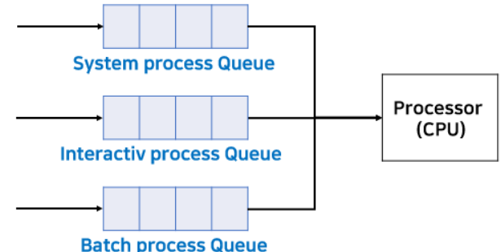
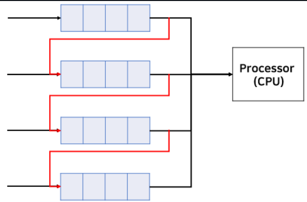
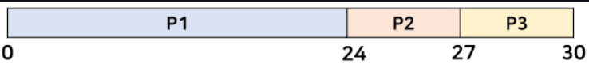
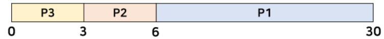
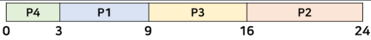
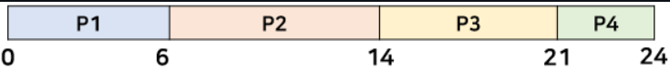

# CPU 스케줄링

---

- CPU가 하나의 프로세스 작업이 끝나면 다음 프로세스 작업을 수행해야한다.
- 이때 어떤 프로세스를 다음에 처리할 지 선택하는 알고리즘을 CPU Scheduling 알고리즘이라 한다.

## Preemptive vs Non-Preemptive

### 1. Preemptive(선점)
- 프로세스가 CPU를 점유하고 있는 동안 I/O나 인터럽트가 발생하지 않았음에도 다른 프로세스가 해당 CPU를 강제로 점유할 수 있다.
- 즉, 프로세스가 정상적으로 수행중인 동안 다른 프로세스가 CPU를 강제로 점유하여 실행할 수 있다.
- 우선순위가 높은 프로세스를 먼저 수행할 때 유리하고 빠른 응답 시간을 요구하는 대화식 시분할 시스템에 유용하다.

### 2. Non-Preemptive(비선점)
- 한 프로세스가 CPU를 점유했다면 I/O나 인터럽트 발생 또는 프로세스가 종료될 때까지 다른 프로세스가 CPU를 점유하지 못하는 것이다.
- 응답 시간을 예측할 수 있고 일괄 처리 방식이 적합하다.
- 중요도가 높은 작업이 낮은 작업을 기다리는 경우가 발생할 수 있다.

---

## 선점형 스케줄링

### 1. SRT(Shortest Remaing Time) 스케줄링
- 짧은 시간 순서대로 프로세스를 수행한다.
- 현재 CPU에서 실행 중인 프로세스의 남은 CPU 버스트 시간보다 더 짧은 CPU 버스트 시간을 가지는 프로세스가 도착하면 CPU가 선점된다.
```
버스트란 특정 기준에 따라 한 단위로서 취급되는 연속된 신호나 데이터의 모임을 말한다. 
즉, 입출력 요청을 위해 CPU 사용을 사용했다가 쉬었다가를 반복한다.
프로세스가 CPU를 사용할 때를 CPU버스트, 입/출력을 기다릴 때를 입/출력 버스트라고 한다.

※ AWS CPU 버스트.
AWS의 서버 자원에서 CPU 사용률이 일정 수준 이상 올라가지 못하도록 제한하는 정책이 있는데, 
CPU 사용률이 기준치 이상을 초과하는 것을 CPU 버스트라고 한다. 
CPU 버스트가 지속되면 서비스 성능에 제약이 가해지거나 초과 비용이 부과될 수 있다
```

### 2. Round Robin 스케줄링
- 시분할 시스템의 성질을 활용한 방법
- 일정 시간을 정하여 하나의 프로세스가 이 시간동안 수행하고 다시 대기 상태로 돌아간다.
- 이러한 작업을 모든 프로세스가 돌아가면서 진행하며, 마지막 프로세스가 끝나면 다시 처음 프로세스로 돌아와 작업을 반복한다.
- 일정 시간을 Time Quantum(Time Slice)라고 부른다. 일반적으로 10 ~ 100msec 사이의 범위를 갖는다.
- 한 프로세스가 종료되기 전에 Time Quantum이 끝나면 다른 프로세스에게 CPU를 넘겨주기 때문에 선점형 스케줄링의 대표적인 예.

### 3. Multi-level Queue 스케줄링
- 프로세스를 그룹으로 나누어, 각 그룹에 따라 Ready Queue(준비 큐)를 여러 개 두며, 각 큐마다 다른 규칙을 지정할 수도 있다.
- 준비 큐를 여러 개로 분할해 관리하는 스케줄링 방법
- 프로세스들이 CPU를 기다리기 위해 한 줄로 서는 것이 아니라 여러 줄로 선다.



### 4. Multi-level feedback Queue 스케줄링
- 기본 개념은 Multi-level Queue 와 동일하나, 프로세스가 하나의 큐에서 다른 큐로 이동 가능하다는 점이 다르다.
- 모든 프로세스는 가장 위의 큐에서 CPU의 점유를 대기하는데 이 상태로 진행하다 대기하는 시간이 오래 걸린다면 아래의 큐로 프로세스를 옮긴다.
- 만약, 우선순위 순으로 큐를 사용하는 상황에서 우선순위가 낮은 아래의 큐에 있는 프로세스에서 `starvation(기아 상태)`이 발생하면 이를 우선순위가 높은 위의 큐로 옮길 수 있다.
```
※ Starvation 상태
특정 프로세스의 우선 순위가 낮아 원하는 자원을 계속 할당받지 못하는 상태, 기아 상태라고도 불린다.

※ Starvation과 DeadLock
deadlock은 프로세스가 자원을 얻지 못해 다음 처리를 못하는 상태이다.
주로 deadlock은 여러 프로세스가 동일 자원 점유를 요청할 때 발생하고, 
starvation은 여러 프로세스가 부족한 자원을 점유하기 위해 경쟁할 때 특정 프로세스는 자원 할당이 안되는 경우를 말한다.
```




## 비선점형 스케줄링

### 1. FCFS(First Come, First Served)
- 가장 먼저 요청한 프로세스에 CPU를 할당해주는 선착순 방식이다.
  - 준비 큐에 먼저 도착한 프로세스가 먼저 CPU를 점유하는 방식
- CPU를 할당받으면 CPU 버스트가 완료될 때까지 CPU를 반환하지 않으며, 할당되었던 CPU가 반환될 때만 스케줄링이 이루어진다.
- Convory Effect(호위효과)가 발생할 수 있다.

#### 1-1. Convory Effect
소요 시간이 긴 프로세스가 짧은 프로세스보다 먼저 도착해서 뒤의 프로세스들이 오래 기다려야 하는 현상
- 아래의 표는 3개의 프로세스와 각 프로세스가 CPU를 사용한 시간(Burst Time)을 나타낸다.
- 평균 대기 시간: 0 + 24 + 27 / 3 = 17msec


- 만약 프로세스가 들어온 순서가 P3, P2, P1이라면 평균 대기 시간은 줄어든다.
- 평균 대기 시간: 0 + 3 + 6 / 3 = 3msec


두 경우 모든 프로세스가 끝난 시간은 30msec로 같지만, 평균 대기 시간으로 봤을 때는 차이가 난다.
즉, 들어온 순서로 수행한다고 해서 반드기 효율적인 것은 아니다.

### 2. SJF(Shortest-Job-First)
- 다른 프로세스가 먼저 도착했더라도 CPU 버스트가 짧은 프로세스에게 CPU를 먼저 할당하는 방식이다.
- 선점, 비선점 모두 가능하다.


- SJF를 사용한 평균 대기 시간 : 3 + 9 + 16 + 0 / 4 = 7msec
- 위의 표를 FCSF를 사용하여 간트 차트로 나타내고 평균 대기 시간을 구해보자


- FCSF를 사용한 평균 대기 시간 : 0 + 6 + 14 + 21 / 4 = 10.25msec

<blockquote>
※ SJF가 평균 대기 시간이 더 짧아 효율적인 CPU 스케줄링 같지만, 매우 '비현실적'이다.<br>
컴퓨터 환경에서는 프로세스의 CPU 점유 시간을 알 수 없다. 
한 프로세스가 실행 중에는 많은 변수가 존재하기 때문에 CPU 점유 시간을 알려면 실제로 수행하여 측정하는 수밖에 없다.
실제 측정한 시간으로 예측하여 SJF를 사용할 수도 있지만, 이는 오버헤드가 매우 큰 작업으로 잘 사용되지 않는다.
</blockquote>

### 3. Prioriy
- 우선순위가 높은 프로세스가 먼저 선택되는 스케줄링 알고리즘이다.
- 우선순위는 정수값으로 나타내며, 작은 값이 우선순위가 높다.
- 선점, 비선점 모두 가능하다.
- 우선순위를 정하는 방법
  - Internal : time limit, memory requirement, I/O to CPU burst(I/O작업은 길고, CPU 작업은 짧은 프로세스 우선) 등
  - External : amount of funds being paid, political factors 등