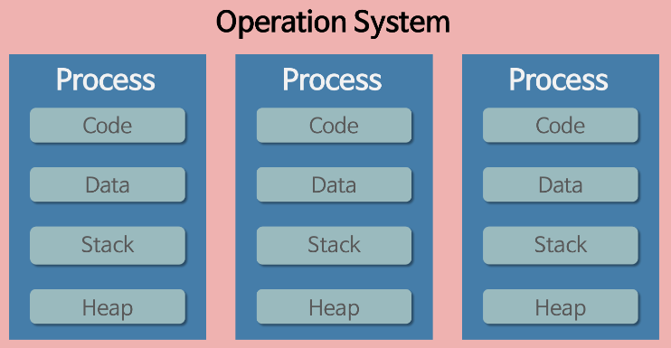
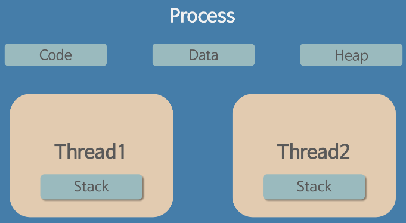

# 프로세슷 & 스레드

---

## 프로그램(Program)
- 특정 작업을 위한 명령문의 집합으로, 정적인 파일로 기기 내 저장공간에 저장되어있지만 메모리에 올라가있지 않은 `실행 가능한 파일`

## 프로세서(Processor)
- CPU, 그래픽 프로세서, 입출력 프로세서와 같은 하드웨어 처리기를 뜻한다.
- 예전의 컴퓨터는 한번에 하나의 동작밖에 수행하지 못했지만, 다중 작업을 가능하게 하는 멀티태스킹 기능이 나오면서 여러 프로세스를 함께 돌리는 것이 가능해졌다.

## 프로세스(Process)
- 메모리에 올라와 실행 중인 프로그램 인스턴스(개별요소)이다. 프로그램의 실행 단위라고 할 수 있다.
- 프로그램이 실행되면 메모리에 올라가고 운영체제로부터 시스템 자원을 할당받는다.
  - 시스템 자원 : CPU 시간, 주소 공간, `Code, Data, Heap, Stack`의 구조로 되어 있는 독립된 메모리 영역
- 기본적으로 프로세스마다 최소 1개의 스레드를 갖는다.
- 한 프로세스는 다른 프로세스의 변수나 자료구조에 접근할 수 없으며, 접근을 위해서는 IPC 통신이 필요하다.
  - IPC : 프로세스들 사이에 서로 데이터를 주고 받는 행위. 
    - ex)파이프, 파일, 소켓, 메시지큐

### 프로세스 메모리 영역
- 코드(Code): 프로세스 코드(사용자가 작성한 코드, 라이브러리 함수 코드)가 적재되는 영역
- 데이터(Data): 프로세스의 전역 변수들과 정적(static) 변수들이 적재되는 영역
- 힙(Heap): 프로세스가 실행 중에 동적 할당받는 영역
- 스택(Stack): 함수가 호출될 때 지역변수, 매개변수, 함수로부터 돌아갈 주소 등이 저장되는 영역

### 프로세스 제어 블록 (Procsess Control Block, PCB)
- 특정 프로세스에 대한 중요한 정보를 저장하고 있는 커널 내의 자료구조
- OS는 프로세스를 관리하기 위해 프로세스의 생성과 동시에 고유한 PCB를 생성한다.
- 프로세스는 CPU를 할당 받아 작업을 처리하다 프로세스 전환이 발생하면 진행하던 작업을 저장하고 CPU를 반환해야 한다.
- 이때 작업의 진행 상황을 PCB에 저장한다. 다시 CPU를 할당 받게 되면 PCB에 저장되었던 내용을 불러와 종료되었던 시점부터 다시 작업을 수행한다.

### 프로세스 문제점
- 프로세스를 실행 단위로 하는 멀티태스킹은 프로세스 생성과 `컨텍스트 스위칭`의 `오버헤드`가 크다.
- 프로세스가 통신에 어려움이 있어 비효율적이다.
  - Context Switching : 실행 중인 프로세스를 중단시키고 다른 프로세스를 실행시키는 것
  - OverHead : 어떤 처리를 하기 위해 들어가는 간접적인 처리 시간, 메모리 등을 말한다.

---

## 스레드(Thread)
- 프로세스의 실행 단위라고 할 수 있으며, 한 프로세스 내에서 동작되는 여러 실행 흐름
- 프로세스 내의 주소 공간이나 자원을 공유할 수 있다.

- 스레드는 프로세스 내의 Code, Data, Heap 영역은 다른 스레드와 공유하고 Stack 영역을 따로 할당받는다.
- 여러 스레드는 한 프로세스 내의 Code, Data, Heap 영역을 공유하지만, 프로세스 간에는 메모리에 접근할 수 없다.
- 스레드는 별도의 레지스터와 스택을 갖고 있으며, 다른 영역을 공유한다. 
- 한 스레드가 프로세스의 자원을 변경하면, 다른 스레드도 그 변경 결과를 즉시 확인할 수 있다.

---

## 멀티 프로세스 (Multi Process)
하나의 응용 프로그램을 여러 개의 프로세스로 구성하여 각 프로세스가 하나의 작업을 처리하도록 하는 것.
- 여러 개의 자식 프로세스 중 하나에 문제가 발생하면 그 자식 프로세스만 죽는 것 이상으로 다른 영향이 확산되지 않는다.(안정성)
- `Context Switching에서의 오버헤드`
  - 프로세스는 각 독립된 메모리 영역을 할당받았기 때문에 공유하는 메모리가 없다
  - 캐시 메모리 초기화 등의 무거운 작업이 진행되고 많은 시간이 소모되는 등의 오버헤드가 발생할 문제가 있다.
- `프로세스 간 통신 기법 IPC`
  - 독립된 메모리 영역을 할당 받았기 때문에 프로세스들 사이에서 변수나 자료구조를 공유할 수 없다.
  - IPC라는 방법을 사용해서 프로세스 간의 통신이 가능하지만 이는 어렵고 복잡한 통신 방법이다.

## 멀티 스레드 (Multi Thread)
하나의 응용 프로그램을 여러 개의 스레드로 구성하고 각 스레드가 하나의 작업을 처리하도록 하는 것.
- 윈도우, 리눅스 등 많은 OS들이 멀티 프로세싱을 지원하고 있지만, 멀티 스레딩을 기본으로 하고 있다.
- 웹 서버는 대표적인 멀티 스레드 응용 프로그램이다.
- 장점
  - 메모리 공간과 시스템 자원 소모가 줄어들게 된다.
  - 스레드 간 통신시, 전역 변수의 공간 또는 동적으로 할당된 공간인 Heap 영역을 이용해 데이터를 주고 받으므로 통신 방법이 간단하다.
  - Context Switching 시, 캐시 메모리를 비울 필요가 없기 때문에 비용도 적고 더 빠르다.
  - 시스템의 처리량이 향상되고 자원 소모가 줄어들며, 자연스럽게 프로그램의 응답 시간이 단축된다.
- 단점
  - 서로 다른 스레드가 Data, Heap 영역 등을 공유하기 때문에 어떤 스레드가 다른 스레드에서 사용 중인 변수나 자료구조에 접근하여 엉뚱한 값을 읽어오거나 수정할 수 있다. 즉, 자원 공유의 문제가 발생한다.(동기화)
  - 하나의 스레드에 문제가 생기면 전체 프로세스가 영향을 받는다.
  - 주의 깊은 설계가 필요하며, 디버깅이 까다롭다.

### 멀티 프로세스 vs 멀티 스레드
- 멀티 스레드는 멀티 프로세스보다 적은 메모리 공간을 차지하고 Context Switching이 빠르다는 장점이 있지만, 오류로 인해 하나의 스레드가 종료되면 전체 스레드가 종료될 수 있다는 점과 동기화 문제를 가지고 있다.
- 반면, 멀티 프로세싱 방식은 하나의 프로세스가 죽더라도 다른 프로세스에는 영향을 끼치지 않고 정상적으로 수행된다는 장점이 있지만, 멀티 스레드보다 많은 메모리 공간과 CPU 시간을 차지한다는 단점이 있다.
- 이 두 가지는 동시에 여러 작업을 수행한다는 점에서 같지만 적용해야 하는 시스템에 따라 적합/부적합이 구분된다.
- 대상 시스템의 특징에 따라 적합한 동작 방식을 선택하고 적용해야 한다.