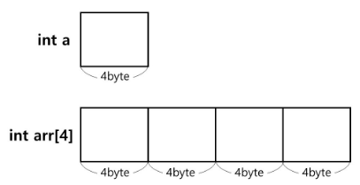

# 배열

---

같은 타입의 변수들로 이루어져 있고 순서대로 나열한 자료구조

- 각 원소는 배열에서 고유한 인덱스를 가진다.
- 인덱스를 사용하여 특정 위치의 원소에 접근할 수 있다.
  - O(1)의 시간 복잡도를 가진다.
- 고정된 크기(정적)를 가지며, 각 원소에 메모리 상에 연속적으로 저장된다.

---

## 장단점

### + 빠른 접근
- 인덱스를 사용하여 특정 위치의 원소에 빠르게 접근 가능하다.
- 인덱스를 알고 있다면 O(1)의 시간 복잡도로 해당 위치의 원소에 접근할 수 있다.

### + 메모리 효율성
- 원소들이 연속적으로 메모리에 저장되기 때문에 `캐시 지역성`을 활용할 수 있다.
  - 지역성 (Locality)
    - 기억 장치 내의 정보를 균일하게 Access하는 것이 아닌 어느 한 순간에 특정 부분을 집중적으로 참조하는 특성

### - 고정된 크기
- 배열의 크기를 선언할 때 고정되며, 크기를 동적으로 조절할 수 없다.
- 크기를 변경하려면 새로운 배열을 만들어 데이터를 복사해야 한다.

### - 메모리 낭비
- 크기가 고정되어 있어 배열을 선언할 때 최대 크기로 메모리를 할당받게 된다.
- 만약 배열의 실제 크기가 최대 크기보다 작다면 메모리가 낭비된다.

### - 삽입/삭제의 비효율성
- 삽입, 삭제가 발생할 경우, 해당 위치 이후의 모든 원소를 이동시켜야 한다.
- 삽입과 삭제의 시간 복잡도가 O(n)이 되어 비효율적이다.

### - 삭제된 원소 공간 낭비
- 삭제된 원소의 공간은 남게 되며, 이를 활용하려면 추가적인 관리가 필요하다.

---

## 랜덤 접근과 순차적 접근

#### 1. 랜덤 접근(Random Access)
- 임의 접급, 직접 접근이라고도 불린다.
- 동일한 시간에 배열과 같은 순차적인 데이터가 있을 때 임의의 인덱스에 해당하는 데이터를 접근할 수 있는 기능
- 배열, 리스트와 같은 자료구조에서 랜덤 접근이 가능하다.
- O(1)의 시간 복잡도를 가진다.

#### 2. 순차적 접근(Sequential access)
- 데이터를 처음부터 순서대로 읽어나가는 방식
- 연결 리스트나 파일의 순차적인 읽기 등이 순차적 접근에 해당한다.
- O(n)의 시간 복잡도를 가진다.