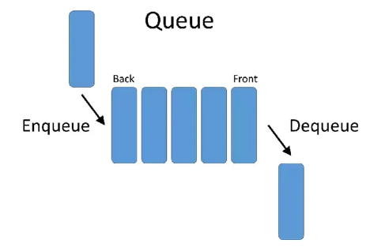

# Stack과 Queue

---

## Stack
가장 마지막으로 들어간 데이터가 가장 첫 번 째로 나오는 성질을 가진 자료 구조
- LIFO(Last in First Out) 구조
- 삽입 및 삭제에 O(1), 탐색에 O(n)의 시간 복잡도를 가진다.
- 웹 브라우저 방문 기록, 실행 취소, 역순 문자열 만들기, 후위 표기법 계산 등에 쓰인다.
- Push : 데이터를 스택의 맨 위에 추가.
- Pop : 스택의 맨 위에 있는 데이터를 제거.

---

## Queue
먼저 들어간 원소가 먼저 나오는 구조이다.
- FIFO(First in First out) 구조
- 먼저 삽입된 요소가 먼저 제거되고, 나중에 삽입된 요소는 나중에 제거된다.
- 대기열, 버퍼, 작업 스케줄링 등에 사용된다.
- 큐의 활용분야로 안드로이드의 경우, 루퍼의 메시지 큐가 예시 중 하나이다.
- Enqueue(삽입) : 큐의 뒤쪽(마지막)에 요소를 추가
- Dequeue(제거) : 큐의 앞쪽(첫 번째)에서 요소를 제거

