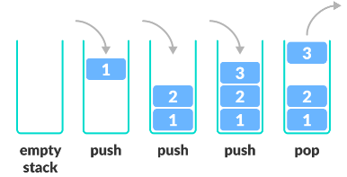

# Stack과 Queue

---

## Stack
가장 마지막으로 들어간 데이터가 가장 첫 번 째로 나오는 성질을 가진 자료 구조
- LIFO(Last in First Out) 구조
- 삽입 및 삭제에 O(1), 탐색에 O(n)의 시간 복잡도를 가진다.
- 웹 브라우저 방문 기록, 실행 취소, 역순 문자열 만들기, 후위 표기법 계산 등에 쓰인다.
- Push : 데이터를 스택의 맨 위에 추가.
- Pop : 스택의 맨 위에 있는 데이터를 제거.

