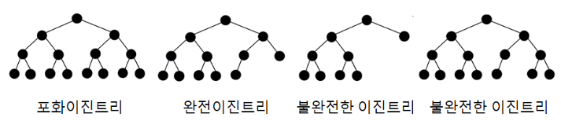
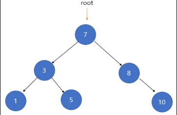

# Tree(트리)

---

그래프 중 하나로 `정점(Node)`와 `간선(Edge)`으로 이루어져 있다.

- 정점(Node) : 트리를 구성하는 기본 요소로, 데이터와 다른 노드와의 연결 정보를 가지고 있다.
- 간선(Edge) : 노드와 노드를 연결하는 선. 부모 노드와 자식 노드를 연결한다.

트리는 루트 노드로부터 하위에 자식 노드를 두는 일종의 `계층적 데이터의 집합`이다.
- 루트(Root) 노드 : 최상위 노드로 유일하다.
- 리프(Leaf) 노드 : 자식 노드가 없는 노드를 말한다.
- 깊이(depth) : 루트에서 어떤 노드까지의 간선 수로, 레벨(Level)이라고도 한다.
- 높이(height) : 트리의 최대 깊이


### 트리의 특징
- 부모 자식 관계를 가지는 `계층형 자료구조`로, 방향성이 있으면, 모든 자식 노드는 하나의 부모 노드만 갖는다.
- 두 개의 노드 사이에는 한 개의 간선을 가지며, 사이클(Cycle)이 존재하지 않아 `최소 연결 트리` 라고 부르기도 한다.
- 트리 내에 하위 트리(Sub Tree)가 있는 `재귀적 자료구조`이다.
- 노드가 n개인 트리는 항상 n-1개의 간선을 가진다.
```
※ 재귀적 자료구조
자료구조의 각 요소가 같은 자료구조의 일부분이 되어 자기 자신을 참조하거나 포함하는 구조를 가진다.
주요 재귀적 자료구조로는 재귀적인 트리가 있다.

재귀적인 트리
- 각 노드가 다시 하위 트리의 루트가 될 수 있는 구조
- 이진 트리는 각 노드가 최대 두 개의 하위 노드를 가질 수 있는 재귀적 트리의 예이다.
```

### 트리의 순회
트리의 순회란 트리의 각 노드를 체계적인 방법으로 탐색하는 과정을 의미한다.<br>
노드를 탐색하는 순서에 따라 `전위 순회(Preorder)`, `중위 순회(Inorder)`, `후위 순회(Postorder)`로 분류된다.

#### 1. 전위 순회(Preorder)
- 루트 노드 -> 왼쪽 서브트리 -> 오른쪽 서브트리 순서로 순회
- 깊이 우선 순회라고도 불린다.


#### 2. 중위 순회(Inorder)
- 왼쪽 서브트리 -> 노드 -> 오른쪽 서브트리 순서로 순회
- 대칭 순회라고도 불린다.


### 3. 후위 순회(Postorder)
- 왼쪽 서브트리 -> 오른쪽 서브트리 -> 노드 순서로 순회


---

### 트리의 종류

#### 1. 편향 트리 (Skew Tree)
- 모든 노드들이 자식 노드를 하나씩만 가진 트리.
- 왼쪽 방향으로만 자식을 가지면 Left Skew Tree, 오른쪽 방향으로만 자식을 가지면 Right Skew Tree라고 한다.


#### 2. 이진 트리 ((Binary Tree))
이진트리는 각 노드의 자식 수가 2개 이하인 트리이다.



#### 3. 이진 탐색 트리 (Binary Search Tree)
- 정렬된, 순서화된 이진 트리이다.
- 노드의 왼쪽 자식은 부모보다 작은 값, 오른쪽 자식은 부모보다 큰 값을 갖는다.

