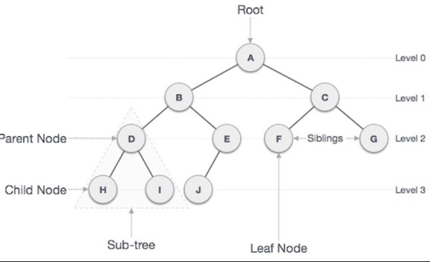

# Tree(트리)

---

그래프 중 하나로 `정점(Node)`와 `간선(Edge)`으로 이루어져 있다.

- 정점(Node) : 트리를 구성하는 기본 요소로, 데이터와 다른 노드와의 연결 정보를 가지고 있다.
- 간선(Edge) : 노드와 노드를 연결하는 선. 부모 노드와 자식 노드를 연결한다.

트리는 루트 노드로부터 하위에 자식 노드를 두는 일종의 `계층적 데이터의 집합`이다.
- 루트(Root) 노드 : 최상위 노드로 유일하다.
- 리프(Leaf) 노드 : 자식 노드가 없는 노드를 말한다.
- 깊이(depth) : 루트에서 어떤 노드까지의 간선 수로, 레벨(Level)이라고도 한다.
- 높이(height) : 트리의 최대 깊이

