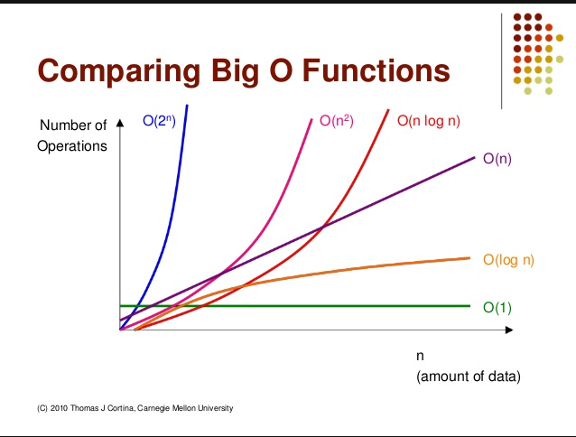

# 복잡도

---

### 빅오 표기법 (Big-O)
- 불필요한 연산을 제거하여 알고리즘 분석을 쉽게 할 목적으로 사용된다.
- Big-O로 즉정되는 복잡성에는 시간과 공간 복잡도가 있다.


### 시간 복잡도
- 알고리즘의 성능을 설명하는 것.
- 알고리즘을 수행하기 위해 프로세스가 수행해야하는 연산을 수치화한 것이다.
- 실행시간이 아닌 연산수치로 판별하는 이유
  - 명령어의 실행시간은 컴퓨터의 하드웨어 또는 프로그래밍 언어에 따라 편차가 크게 달라지기 때문에 명령어의 실행 횟수만 고려하는 것이다.

시간 복잡도에서 중요하게 보는 것은 가장 큰 영향을 미치는 n의 단위이다.
```java
// O(1) – 상수 시간 : 문제를 해결하는데 오직 한 단계만 처리함.
System.out.println("Hello, World!");

// O(n) – 직선적 시간 :문제를 해결하기 위한 단계의 수와 입력값 n이 1:1 관계를 가짐.
// 입력이 증가하면 처리 시간 또는 메모리 사용이 선형적으로 증가한다.    
for (String s : list) {
    System.out.println(s);
}

// O(n ^ 2) – 2차 시간 :문제를 해결하기 위한 단계의 수는 입력값 n의 제곱.
// 반복문이 두 번 있는 케이스
for (String s : list) {
    for (String v : list) {
      System.out.println(s);
      System.out.println(v);
    }
}

// O(log n) – 로그 시간 :문제를 해결하는데 필요한 단계들이 연산마다 특정 요인에 의해 줄어듬.
// O(n log n) :문제를 해결하기 위한 단계의 수가 N*(log2N) 번만큼의 수행시간을 가진다.(선형로그형)
```

### 공간 복잡도
- 알고리즘에서 사용하는 메모리 양을 나타낸다.
- 보조 공간과 입력 공간을 합친 포괄적인 개념.
  - 보조 공간 : 알고리즘이 실행되는 동안 사용하는 임시 공간
- 데이터를 저장할 수 있는 메모리의 발전으로 중요도가 낮아졌다.