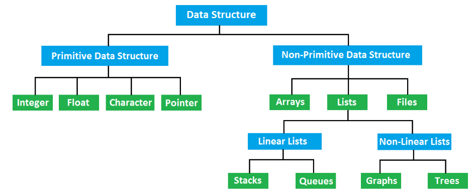

# 자료 구조

---

## 자료 구조란?
- 데이터 값의 모임
- 각 원소들이 논리적으로 정의된 규칙에 의해 나열
- 자료에 대한 처리를 효율적으로 수행할 수 있도록 자료를 구분하여 표현한 것.

<b>메모리 공간을 효율적으로 사용해야 하는데 필요한 것.</b>

### 자료 구조와 알고리즘의 관계
알고리즘?
- 어떤 문제를 해결하기 위해 정해진 일련의 절차나 방법을 공식화한 형태
- 문제풀이에 필요한 계산절차 또는 처리과정의 순서

여러가지 상황에 따른 알고리즘은 모두 다르다. 
따라서 시간 복잡도가 가장 낮은 알고리즘을 선택하여 사용한다.
<blockquote>
알고리즘의 실행시간은 컴퓨터가 알고리즘 코드를 실행하는 속도에 의존한다.  
이 속도는 컴퓨터의 처리속도, 사용된 언어종류, 컴파일러의 속도에 달려있다.
</blockquote>

`자료구조의 선택`은 `효율적인 알고리즘의 선택`이 된다. 
또한, 알고리즘을 프로그램 명령어들의 집합이라고도 한다.

프로그램은 특정 문제를 해결하기 위한 처리 방법과 순서를 기록한 명령어들의 모음. 
프로그램이 실행되기 위해서는 메모리에 올릴 데이터가 필요하며 이 데이터들을 담아내는 방식이 자료구조.

즉, 넓은 의미에서 `자료구조 + 알고리즘 = 프로그램`이라 할 수 있다.

---

## 필수 자료 구조

### Primitive Data structure (원시)
자료를 구성하는 가장 기본적인 단위

- Integer(정수)
- Float(실수)
- Character(문자)
  - 문자뿐만 아니라 띄어쓰기, tab, enter 같은 공백문자도 포함
- Pointer(포인터)
  - 정수, 실수, 문자처럼 의미있는 값을 갖지 않는다.
  - 자료형이 컴퓨터 메모리 내에서 저장된 곳
  - 메모리 내의 주소값을 통해 자료형의 실제 값을 불러낼 수 있다.

### NonPrimitive Data structure (비원시)

#### 1. Arrays (배열)
- 자료형을 원소로 취급해 나열한 것.
- 인덱스를 통해 빠른 접급이 가능하다.
- 데이터를 저장할 수 있는 메모리 크기가 고정되어 있다.
- 크기가 정해진 자료를 다룰 때 유용.

#### 2. Files
- 자료를 하드디스크 또는 2차 저장소에 저장할 때 사용.
- 파일명, 구분자(.), 파일에 맞는 확장자(dat,txt,png...) 로 나뉜다.

#### 3. Lists
자료가 순서대로 나열된 구조, 즉 순서를 갖는 자료구조이다.