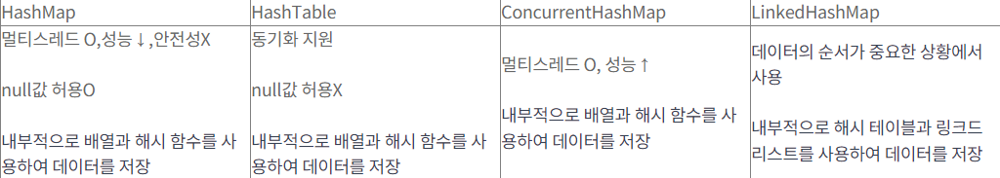

# Java

---

### Managed - Unmanaged 언어의 차이는 무엇이고 어떤 장, 단점이 있나요?
**Managed**
- Managed 언어는 런타임 환경 내에서 프로그램을 생성하도록 설계된 언어.
- OS 위에 VM을 두어 소스코드를 컴파일 하는 과정은 VM 위에서 이루어진다.
- Java는 Managed 언어이다.

**Unmanaged**
- Unmanaged 언어는 반대로 런타임 환경의 관리를 받지 않는 언어
- C, C++
> 런타임 환경 : 애플리케이션이 OS의 시스템 자원에 액세스할 수 있도록 해주는 실행 환경(VM)

### Java 접근 제어자에는 무엇이 있는지 설명해주시고 Protect와 Private는 어느 시점에 어떻게 사용될 수 있는지 이야기 해주세요.
- public, default, private, protect
- private은 클래스 내에서만 접근이 가능하다
  - 클래스 내부 구현을 숨기고 외부에서 접근하지 못하도록 캡슐화할 때 사용된다.
  - private을 사용하여 객체의 상태를 보호하고 데이터 수정을 방지할 수 있다.
- protect는 상위 클래스를 상속받은 하위 클래스에서 접근이 가능하다.
- default는 **같은 패키지 내**의 다른 클래스들에서 접근할 수 있다.
  - 접근 제어자를 명시하지 않은 경우에 적용된다.

### JVM의 메모리 구조에 대해서 설명해 주세요.
- Runtime Data area의 메모리 영역을 의미
- **Method Area** : 로드된 클래스의 메타데이터(클래스 이름, 부모 클래스 이름, 메서드, 변수)를 저장
  - static 변수, 상수, 메서드 코드가 저장
    - JDK7까지 static 변수들은 Method Area에 저장되었지만 JDK8부터는 Heap Area로 이동
    - 따라서 static 변수도 GC의 대상이다.
  - 모든 스레드에 공유되는 영역
- **Heap Area** : 모든 객체의 인스턴스와 배열이 저장된다.
  - GC가 관리
  - 모든 스레드에 공유되는 영역
- **Stack Area** : 메서드 호출 시마다 프레임(해당 메서드만을 위한 공간)이 생성된다.
  - 호출된 메서드의 매개변수, 지역변수 등을 임시로 저장
  - 메서드 수행이 끝나면 프레임을 삭제한다.
  - 각 스레드마다 [별도로 할당](src/main/java/org/example/Operating%20System/프로세스&%20스레드.md) 되는 메모리 공간
- **PC Register** : 스레드가 시작될 때 생성되며, 각 스레드마다 하나씩 존재한다.
  - 쓰레드의 문맥 교환(Context Switch) 시 정확한 실행 위치를 유지한다
  - 현재 수행중인 JVM 명령의 주소를 갖는다.
- **Native method stack** : 자바 외 언어로 작성된 네이티브 코드를 위한 메모리 영역
  - **JNI(Java Native Interface)** : 자바가 다른 언어로 만들어진 애플리케이션과 상호 작용할 수 있는 인터페이스 

### JVM은 어떤 방식으로 코드를 해석하고 실행시키는지 흐름에 맞게 설명해 주세요. (Java 실행 흐름)
- 자바 컴파일러(javac)
  - 자바 소스 파일을 바이트코드 파일인 class 파일로 변환
  - 바이트코드는 JVM이 이해할 수 있는 명령어들로 구성된다.
- Class Loader
  - 필요한 클래스를 로딩해서 메모리에 올린다.
  - 런타임 시에 동적으로 클래스를 로드한다.
  - 로드된 바이트 코드들을 엮어 JVM 메모리 영역인 Runtime Data Area에 배치
- Runtime Data Area
  - Jvm 메모리 영역으로 자바 애플리케이션을 실행할 때 사용되는 데이터를 적재하는 영역
  - 메모리를 할당 받아 관리하는 영역
  - Method Area, Heap Area, Stack Area, PC Register, Native Method Stack
- Execution Engine
  - Class Loader를 통해 Runtime Data Area에 배치된 **바이트 코드들을 명령어 단위로 읽어서 실행**
  - 메모리에 로딩된 코드를 해석하고 실행
  - **인터프리터**
    - 바이트코드를 한 줄씩 읽고 실행, 하지만 반복문 등에서 비효율적이다.
    - JVM은 기본적으로 인터프리터 방식으로 동작
  - **JIT 컴파일러** 
    - 자주 실행되는 바이트코드 부분을 네이티브 코드로 변환하여 성능을 향상
    - 인터프리터 방식을 사용하다 일정 기준이 넘어가면 JIT 컴파일 방식으로 명령어를 실행
  - **Garbage Collector**
    - Heap 메모리 영역에 생성된 객체들 중에서 참조되지 않은 객체를 탐색해 제거.

### Garbage Collector은 무엇인가요?
- Heap 메모리 영역에서 참조되지 않은 객체를 제거
- Heap 영역 -> Young Generation의 Eden영역, Survivor영역(S0,S1)
- 객체가 생성되면 Eden 영역에 저장된다.
- 객체가 쌓여 Eden 영역이 차게되면 GC가 실행되는데 mark-sweep-compact 방식으로 실행된다.
  - mark : 살아있는 객체를 찾아 마킹
  - sweep : 참조하고 있지 않은 쓰레기 객체를 Heap에서 제거
  - compact : 살아있는 객체들을 한 곳으로 모은다.
- Eden 영역에서 살아남은 객체들은 Survivor 영역에 이동한다.
  - 살아남은 객체의 age가 1씩 증가
- age가 기준(jdk의 경우 31)만큼 커지면 Old Generation으로 이동된다.

### GC가 자주 발생된다면 어떤 문제가 있을까요?
- STW(Stop The World) : GC가 작동되는 동안에는 모든 애플리케이션 스레드가 중단
  - 응답시간 지연
- 불필요한 객체를 만들어내는 상황을 줄이자!

### Java는 Call By Value일까요, Call By Reference 일까요?
- **Java는 기본적으로 Call By Value이다.**
- 객체 참조 변수를 메서드 인자로 전달할 때 메서드에서 객체의 필드 값은 변경할 수 있지만 객체 자체를 변경할 수는 없다.
  - 객체 참조 변수의 메모리 주소를 복사해서 전달하기 때문
- Call By Value : 함수에 값을 전달할 때 값을 복사하여 전달하는 방식
  - 원본 데이터를 보호할 수 있는 장점이 있지만, 큰 데이터의 경우 메모리 사용량이 높다.
  - Java는 객체의 참조 값을 전달하기 때문에, 객체의 속성 변경을 하게 되면 원본 객체에 영향을 준다.
  - 객체의 참조 값은 스택 영역에, 객체의 속성 값은 힙 영역에 저장되는데, 이때 스택 영역의 참조 값만 복사되고, 힙 영역의 속성 값들은 복사되지 않는다.
- Call By Reference : 함수에 값을 전달할 때 메모리 주소를 전달하는 방식
  - Java에서는 지원되지 않는다.
  - C++ 에서는 함수 내부에서 참조를 통해 값을 변경하면, 호출자의 값에도 영향을 미친다.

### Shallow Copy와 Deep Copy의 차이는 무엇인가요? 자바에서 Deep Copy를 하기 위해서는 무엇을 사용하여야 하나요?
- 참조필드를 가지고 있는 경우, Shallow Copy는 참조필드는 복사되지 않고, **원본 객체의 참조를 그대로 사용한다.**
  - 복사된 객체의 참조필드를 변경하면 원본 객체의 참조필드의 값도 변경된다.
  - call by value 로 전달된 객체 참조와 비슷하게 작동한다.
- Deep Copy는 참조필드를 개별적으로 복사하여 **원본객체와 완전히 독립된 객체를 만든다.**
- Deep Copy 를 하기 위해 clone 메서드를 재정의하여 각 필드를 개별적으로 복사해야 한다.

### Java Reflection이란 무엇이고, 어떨 때 사용되는 것인가요?
- 클래스나 멤버에 대한 정보를 런타임에 조사하고, 조작할 수 있는 기능
- 구체적인 클래스 타입을 알지 못해도, 클래스의 메서드, 타입, 변수들에 접근할 수 있도록 해주는 자바 API
- Method Area에 있는 메타데이터를 런타임에 검사하고 조작할 수 있는 기능
- 사용
  - 런타임에 클래스 정보를 동적으로 가져오는 경우
  - 자동화된 테스트 도구나 개발 도구에서 사용하는 경우

### Java Stream API의 특징은 무엇이 있나요?
- 컬렉션 객체에 대한 연산 코드를 간단하게 정리하고 코드의 의도를 명확하게 전달할 수 있다.
- 특징
  - 지연연산 : 최종 연산이 호출될 때까지 중간 연산을 수행하지 않는다.
  - 불변성 : 스트림의 각 연산은 원본 데이터를 변경하지 않는다.
    - 변경 대신, 새로운 객체로 생성한다.
  - 병렬처리 : 메서드 하나로 쉽게 병렬처리가 가능하다.

### iterator와 iterable 차이는 무엇인가요?
- Iterable는 자바 컬렉션을 순회할 수 있도록 해주는 인터페이스.
  - Iterator를 반환하는 iterator()를 제공한다.
- Iterator는 컬렉션의 요소를 순회하는 방법을 정의한다.
  - hasNext(), next(), remove()
- **Iterable은 컬렉션이 forEach 루프와 호환되도록 보장하고, Iterator는 순회 및 요소 제거와 같은 구체적인 작업을 수행한다.**

### 자바의 synchronized 키워드에 대해 설명해주시고, synchronized Lock 범위에 대해서 알려주세요. (Class Lock, Instance Lock)
- 메서드나 블록을 동기화하는 키워드로, 코드가 한 번에 하나의 스레드에 의해서만 실행될 수 있도록 보장한다.
- synchronized가 적용된 부분은 락을 획득한 스레드만 접근할 수 있으며, 락이 해제되었을 때 다른 스레드가 접근할 수 있다.
- **instance lock** 
  - 인스턴스 메서드나 블록에 대한 락
  - 각 객체마다 별도의 락을 가진다.
  - 동일 클래스의 다른 객체들은 각각 독립적으로 락을 가질 수 있다.
- **class lock**
  - 정적 메서드나 블록에 대한 락
  - 해당 클래스의 모든 정적 메서드 및 블록에 적용된다.
  - 클래스마다 하나의 락을 가진다.
  - 동일 클래스의 모든 정적 메서드와 블록은 하나의 락을 공유한다.

### 자바의 synchronized와 Reentrant Lock와의 차이는 무엇인지 말씀해주세요.
- Reentrant Lock 은 synchronized 보다 **더 많은 기능과 유연성을 제공하는 락 메커니즘**이다.
- 재진입 가능, 공정성 설정, 타임아웃 기능, 락 상태 확인 등 구체적인 락 구현이 가능하다.
- 공정성 
  - 락 내부에서 큐를 사용하여 대기 중인 스레드의 순서를 보장하는데, 락이 해제되면 대기 큐의 맨 앞에 있는 스레드가 우선적으로 락을 획득한다.
  - 대기 큐를 관리하기 때문에 상황에 따라 성능에 좋지 않을 수 있고, 빠르게 처리되어야 하는 스레드가 락을 요청하면 바로 락을 획득하지 못하고 대기 큐에 들어가야 한다.
- 비공정성
  - 공정 락보다 성능 면에서 효율적일 수 있으나, 특정 스레드가 락을 오랫동안 획득하지 못할 가능성이 있다.

### volatile 키워드에 대해 설명해 주세요.
- 변수의 값을 읽거나 쓰는 작업을 메인 메모리에서 수행하겠다라는 것을 명시한다.
- 각 스레드는 성능 향상을 위해 메인 메모리에서 읽은 변수 값을 cpu cache 에 저장한다.
- 멀티 스레드 환경에서는 변수의 값을 읽어올 때 각각의 cpu cache에 저장된 값이 다르기 때문에 변수 값 불일치 문제가 발생한다.
- volatile 키워드가 붙은 변수는 모든 스레드에게 가시성을 보장한다.
  - 한 스레드가 변수의 값을 변경하면, 다른 모든 스레드가 즉시 변경된 값을 볼 수 있다.
  - 가시성은 보장하나, 원자성은 보장하지 않는다. 단순한 플래그나 상태 체크에 적합하다.
  - 여러 스레드가 변수의 상태를 변경하는 상황에서는 적합하지 않다.
  - 이런 상황에서는 synchronized를 통해 원자성을 보장할 수 있다.

### Atomic Type과 CAS는 무엇이고 언제 사용되는 것인가요?
- 원자적 연산을 제공하는 클래스로, 동시성 문제를 해결하기 위해 사용된다.
- Wrapping 클래스의 일종으로, 사용 시 내부적으로 Compare-and-swap 알고리즘을 사용해 lock 없이 동기화 처리를 할 수 있다.
- CAS는 현재 주어진 값과 실제 메모리에 저장된 데이터를 비교해서 두 개가 일치할 때만 값을 수정한다.
  - 현재 연산에서 기대하는 값과 메모리 상에서의 값이 일치하지 않는다면 다른 스레드가 접근했다 판단하여 수정하지 않는다.
  - CAS는 락을 사용하지 않으므로 락 경합이 일어나지 않는다.
  - 락 대신 루프를 돌기 때문에 CPU 자원을 많이 소모할 수 있다.
- 동시성 문제가 발생하고, 원자적 연산이 필요할 때 Atomic type을 사용하는 것이 좋다.

### 불변 객체는 무엇이고 Java에서 어떻게 구현할까요?
- 불변객체란 생성된 이후, 그 상태를 변경할 수 없는 객체를 의미한다.
- 변수, 메서드, 클래스에 final 키워드를 붙여 불변 객체를 만들 수 있다.
- 필드를 private 으로 선언하여 외부에서 직접 접근할 수 없도록 한다.
  - final을 붙이지 않아도 객체의 값을 변경할 수 있는 방법이 없다면 그 객체는 불변하다고 할 수 있다.

### Java final 키워드에 대해서 설명해주세요. 각각의 쓰임에 따라 어떻게 동작하나요? (Class, Variable)
- final은 변수, 객체의 값을 재할당할 수 없게 만든다. 코드의 안정성과 일관성을 높이는 데 사용된다.
- final 변수 
  - 초기화된 후 값을 변경할 수 없다.
  - 변수 선언 시 초기화하거나, 생성자에서 초기화해야 한다.
  - 객체의 경우 참조값은 변경할 수 없지만, 객체의 속성은 변경 가능하다.
- final 메서드
  - 하위 클래스에서 오버라이딩할 수 없다.
- final 클래스
  - 다른 클래스에서 상속이 불가능하다.

### String이 final인 이유는 무엇인가요?
- **자바 어플리케이션에서 가장 많이 사용되는 데이터 타입**이므로 메모리 절약을 위한 캐싱 기능이 필요했다.
- JVM에서 String Pool을 사용하여 동일한 문자열 리터럴을 재사용할 수 있도록 최적화
- mutable한 객체는 공유가 불가능하기 때문에 String 객체를 공유하기 위해서 immutable class가 되어야 한다.

### 문자열을 리터럴(string = "abcd")로 할당하는 것과 객체(string = new String("abcd"))로 할당하는 방식의 차이가 무엇인가요?
- 리터럴의 경우 힙영역의 String pool 영역에 저장되고, new 키워드를 사용한 객체 생성은 힙영역에 저장된다.
- 리터럴을 사용할 때, JVM은 먼저 그 리터럴이 String pool에 존재하는지 확인한다.
  - 존재하면, 기존의 문자열 인스턴스에 대한 참조를 반환한다.
  - 존재하지 않으면, 새로운 String 객체를 생성하고 이를 String pool에 저장한다.

### Interface와 Abstract Class의 차이는 무엇인가요?
- 둘 다 추상화를 구현하기 위한 수단
- 추상클래스는 상속을 통해 기능을 이용하고 확장할 수 있다.
- 인터페이스는 메서드 시그니처만을 정의하여 메서드 구현을 강제한다.
- **인터페이스는 다중 구현과 느슨한 결합을, 추상 클래스는 코드 재사용과 일관된 구현을 제공한다.**

### 상속과 다형성에 대해 설명해주세요.
객체 지향 프로그래밍의 특징으로, 코드의 재사용성과 유지보수성을 높일 수 있다. 
- 상속
  - 한 클래스가 다른 클래스의 속성과 메소드를 물려받아 코드 중복을 최소화할 수 있다.
- 다형성
  - 객체의 속성이나 기능이 상황에 따라 여러 가지 형태를 가지는 성질

### Array와 ArrayList의 차이점, LinkedList와 ArrayList의 차이점
- Array vs ArrayList
  - 배열의 크기
    - Array : 고정 크기, 생성 시 크기 지정
    - ArrayList : 동적 크기, 자동으로 크기 조절
  - 타입
    - Array : 동일한 타입의 기본 자료형 및 참조 자료형 저장
    - ArrayList : 참조 자료형만 저장, 기본 자료형은 래퍼 클래스를 사용
  - 성능
    - Array : 인덱스를 통한 접근 O(1)
    - ArrayList : 인덱스를 통한 접근 O(1), 삽입 및 삭제는 O(n)
      - 중간에 요소를 삽입하거나 삭제할 때, 해당 위치 이후의 모든 요소를 이동시켜야 하기 때문에 O(n)
- LinkedList
  - 데이터 접근 시간은 O(n)으로 ArrayList 보다 느리지만, 삽입 및 삭제 시간은 O(1)로 ArrayList보다 빠르다.
    - 처음부터 순차적으로 노드를 탐색해야하기 때문에 접근에 느리다.
    - 노드의 참조만 변경하면 되기 때문에 삽입, 삭제에 빠르다.
  - ArrayList와 달리 각 노드가 분산된 메모리에 저장될 수 있다.

### HashMap에 대해서 설명
- 키와 값을 쌍으로 저장하는 자료구조
  - 키는 유일해야하며, 동일한 키를 다시 저장하면 이전 값이 새로운 값으로 덮어쓰여진다.
- 내부적으로 해시 테이블을 사용하는데, 해시 함수는 키를 해시 코드로 변환하고, 이 해시 코드는 배열의 인덱스로 변환되어 저장된다.
  - 해쉬 테이블의 상태에 따라 순서가 달라질 수 있다.
  - 데이터 삽입 순서가 중요한 상황에서는 LinkedHashMap을 사용할 수 있다.

### HashTable
- hashMap과 비슷한 구조로 이루어져있지만 HashTable은 synchronization을 지원한다.
- 스레드 안전하게 사용할 수 있지만 하나의 스레드만 허용하는 동기화로 인해 HashMap보다 성능이 떨어질 수 있다.
- 해시 버킷
  - 해시 테이블에서 데이터를 저장하는 공간
  - 연결 리스트, 트리 구조로 구성
  - 해시 버킷은 배열의 한 인덱스에 해당하며, 버킷 내부에는 키와 값 쌍을 저장하느 엔트리 객체가 저장된다.
  - 해시 함수에 의해 계산된 해시 값이 버킷의 인덱스로 사용된다.

### ConcurrentHashMap에 대한 설명, 어떤 방식으로 스레드 동시성을 보장하나요?
- 스레드 안전한 해시맵 구현체. 세분화된 락을 사용하여 성능과 동시성을 보장한다.
- 내부적으로 세그먼트라는 작은 해시 테이블을 여러 개 만들어 관리한다.
- 전체 해시 테이블은 하나의 큰 해시 버킷으로 관리하는 것이 아니라, 작은 세그먼트 단위로 분할하여 병렬성을 높인다.
  - 각 세그먼트는 자신만의 해시 버킷 배열을 가지고 있으며, 세그먼트 내부의 각 버킷은 엔트리 객체로 구성된다. 
  - 세그먼트는 자체적으로 동기화되어 있으므로, 여러 스레드에서 동시에 접근해도 안전하게 데이터 처리 가능

