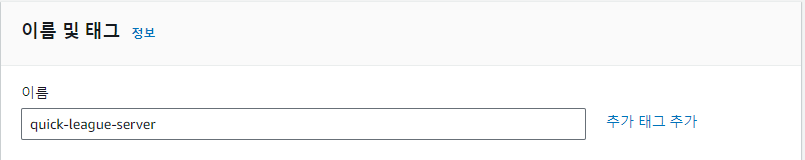
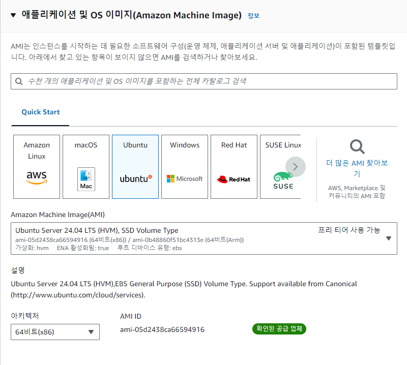
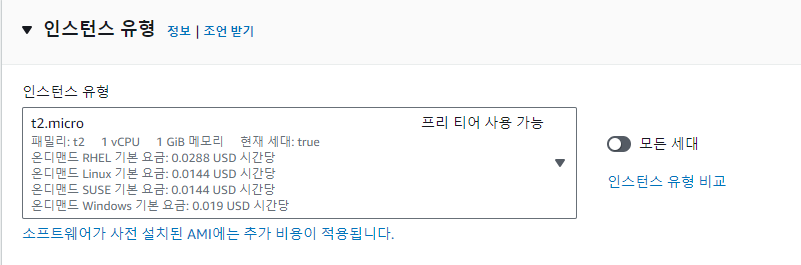
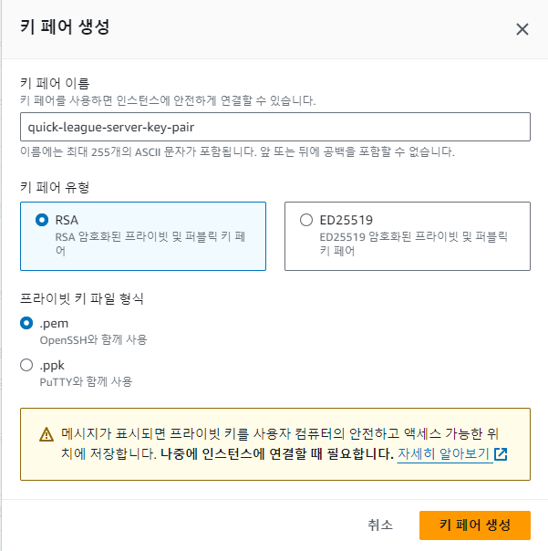
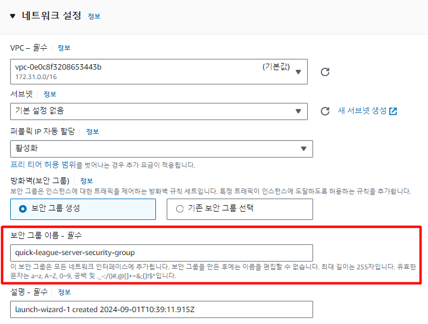
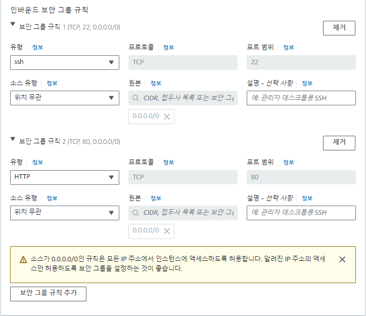
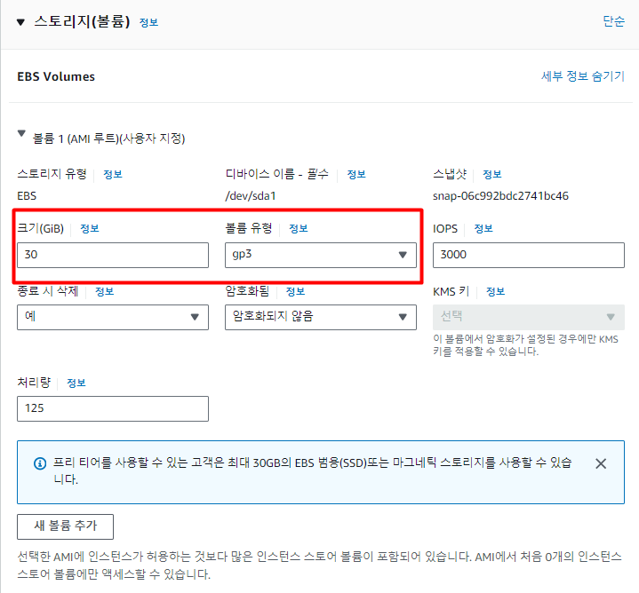

## 리전 (Region)

리전이란 인프라를 지리적으로 나누어 배포한 각각의 데이터 센터를 의미한다.
EC2를 통해 빌려서 쓸 수 있는 컴퓨터들이 위치한 위치를 보고 AWS에서는 리전이라 한다.

### 리전은 어떤 기준을 선택할까?
- `애플리케이션의 주된 사용자들의 위치와 지리적으로 가까운 리전을 선택하는 것이 유리`하다.
- 예를 들어, 한국 유저들이 주로 사용하는 서비스를 만들거라면 리전을 아시아 태평양(서울)로 선택하면 된다.

---

## EC2 - 기본 설정

### 1. 이름 및 태그 설정

- EC2의 이름을 설정하는 곳이다. 이름을 지을 때는 이 컴퓨터가 어떤 역할을 하는 지 알아볼 수 있게 작성한다.

### 2. OS 설정

- OS를 선택하는 단계이다. OS(운영체제)란 Mac, Windows 7, Windows 10, Windows 11 같은 것들이 OS이다. 
- 하지만 Windows나 Mac OS는 생각보다 용량도 많이 차지하고 성능도 많이 잡아먹는다. 
- 그래서 서버를 배포할 컴퓨터의 OS는 훨씬 가벼운 Ubuntu를 많이 사용한다. 

### 3. 인스턴스 유형
- 인스터스란, AWS EC2에서 빌리는 컴퓨터 1대를 의미한다.
- 인스턴스 유형이란, 컴퓨터의 사양을 의미한다.

### 4. 키 페어(로그인)
- EC2 컴퓨터에 접근할 때 사용하는 비밀번호.
- 키 페어 이름은 어떤 EC2에 접근하기 위한 키 페어였는지 직관적으로 설정하는 것이 좋다.

## EC2 - 보안그룹 설정

### 보안 그룹
- AWS 클라우드에서의 네트워크 보안
- EC2 인스턴스 주의에 방화벽 역할을 할 보안 그룹을 만들고, 그룹에 규칙을 정한다.
  - 인바운드 트래픽 : 외부에서 EC2 인스턴스로 보내는 트래픽
  - 아웃바운드 트래픽 : EC2 인스턴스에서 외부로 나가는 트래픽
- 보안 그룹을 설정할 때는 허용할 IP범위와 포트를 설정할 수 있다.

> **잘 알려진 포트란?** 
> 규약을 통해 역할이 정해져있는 포트 번호 
> 22번 (SSH, Secure Shell Protocol) : 원격 접속을 위한 포트번호 
> 80번 (HTTP) : HTTP로 통신할 때 사용 
> 443번 (HTTPS) : HTTPS로 통신할 때 사용

## EC2 - 스토리지 구성

EC2 서버에서 사용할 저장 공간을 EBS(Elastic Block Storage)라 부른다. 
EC2 안에 부착되어 있는 일종의 하드디스크. 
조금 더 포괄적인 용어로는 스토리지, 볼륨이라 부른다.

