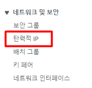

# 탄력적 IP 연결

---

## 탄력적 IP가 왜 필요할까?
EC2 인스턴스를 생성하면 IP를 할당받는다. 하지만 이렇게 할당받은 IP는 임시적인 IP이다.
EC2 인스턴스를 잠깐 중지시켰다가 다시 실행시켜보면 IP가 바뀌어있다.  
EC2 인스턴스를 중지시켰다가 다시 실행시킬 때마다 IP가 바뀌면 굉장히 불편하다.  
그래서 중지시켰다가 다시 실행시켜도 바뀌지 않는 고정 IP를 할당받아야 한다.

