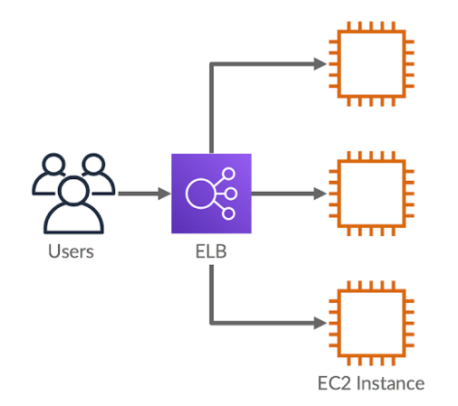

## ELB를 활용한 아키텍처 구성

### 기존 EC2 아키텍처
- 사용자들이 EC2의 IP 주소 또는 도메인 주소에 직접 요청을 보내는 구조였다.

### ELB 도입 후 아키텍처

- ELB 를 추가적으로 도입함으로써 사용자들이 EC2에 직접적으로 요청을 보내지 않고, ELB에 요청을 보낸다.

ELB 생성 후 기존 EC2 에 연결했던 도메인을 ELB에 연결해줘야한다.
기존 EC2 도메인을 삭제하고 ELB로 도메인을 다시 연결해준다.

### HTTPS 적용을 위한 인증서 발급
- AWS Certificate Manager 접속
- 인증 받을 도메인 입력 후 발급
  - Route 53 레코드 생성

### ELB 에서 HTTPS 설정
- EC2 > 로드밸런서 접속
- 생성한 ELB에 리스너 규칙 추가
- 보안 리스너 설정 > 발급받은 인증서 설정
- HTTPS 가 설정되어도 HTTP로도 접속이 가능하다
  - HTTP 로 접속했을 때 HTTPS 로 접속이 될 수 있도록 설정이 필요하다.
  - 기존 로드밸런스 HTTP:80을 삭제 후 리스너 추가
  - 라우팅 액션 섹션에서 `URL로 리디렉션` 선택 > HTTPS 443 설정

### ELB vs Nginx,Certbot
- 현업에서는 ELB를 활용해서 HTTPS 적용을 더 많이 시킨다.
  - 설정도 쉽고, HTTPS 인증서의 만료 기간 갱신도 자동으로 해주기 때문
- Nginx 를 사용하는 상황은 언제일까
  - ELB 도 하나의 서버이기 때문에 사용하는 것 자체로 비용이 나간다.
  - 비용이 부담되는 경우 ELB를 사용하지 않고 백엔드 서버와 Nginx, Certbot을 하나의 EC2에 설치해서 사용하는 경우가 있다.
  - Certbot : Let's Encrypt(인증기관) 를 이용해서 ssl 인증성 발급, 갱신할 수 있게 도와주는 오픈소스 툴

### EC2와 ELB
- EC2는 애플리케이션 서버를 운영하고, ELB는 들어오는 사용자 요청을 여러 EC2 인스턴스에 로드 밸런싱하여 성능을 높이는 역할을 한다.
- EBL는 서버의 부하를 분산하고, 트래픽이 증갈할 때 자동으로 인스턴스를 추가하는 등 확장성을 제공한다.