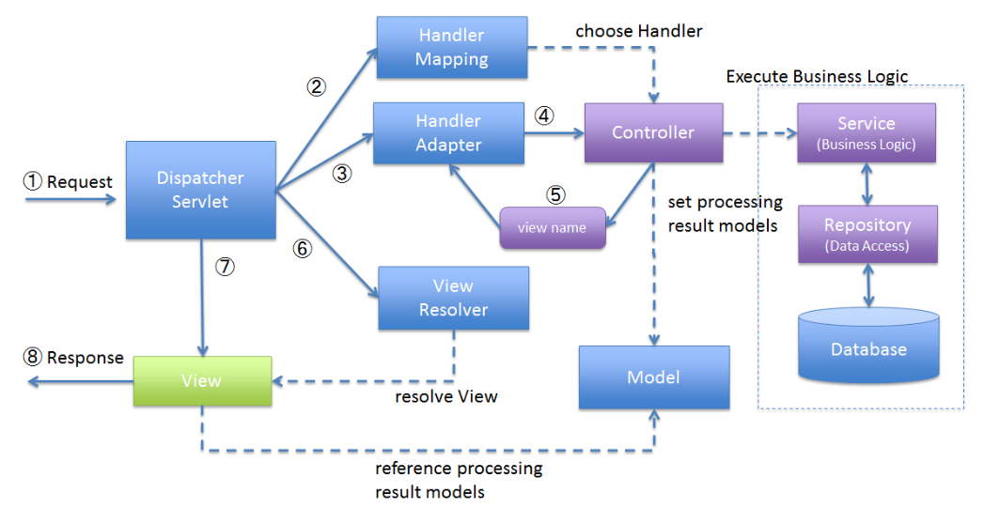

# Spring

---

### Servlet
- Http 요청을 처리하고 동적 웹 페이지를 생성
- 웹 요청을 Servlet으로 처리하게 된다면 개발자는 비즈니스 로직에 집중할 수 있다.
- 클라이언트의 요청에 맞는 서비스를 처리하고 응답

### Servlet은 어떻게 관리되나요?
- 사용자 요청이 들어오면 Servlet Container는 해당 요청에 맞는 servlet을 찾는다.
- 찾고자 하는 Servlet 인스턴스가 존재한다면 그대로 사용하고, 없다면 새로운 Servlet을 생성한다.
- Servlet Container에 스레드를 생성하고 HttpServletRequest, HttpServletResponse를 인자로 service 실행
- 요청이 처리되면 생성된 Request, Response 객체는 소멸된다.
- 여기서 작업이 끝난 서블릿 자체는 소멸되지 않는데 그 이유는 싱글톤으로 관리되기 때문이다.
- Servlet Container는 Servlet의 생명주기를 관리한다.

### Front Controller Pattern
- 각 서블릿의 중복된 로직을 하나의 서블릿에서 처리할 수 있게 하는 패턴
- 클라이언트의 요청을 앞단에서 전담하는 매니저 역할
- Spring Mvc에서는 이것을 Dispatcher Servlet이라 한다.

### Spring 이란? (EJB-J2EE 비교 설명)
- 좋은 객체 지향 애플리케이션을 개발할 수 있게 도와주는 프레임워크

### IOC, DI ?
- IoC : 제어의 역전
  - 기존에는 객체가 직접 다른 객체를 생성하고 관리했다. IOC를 사용하면 객체 생성과 관리를 개발자가 아닌 프레임워크가 맡게 된다.
  - 클래스 간 결합을 느슨히 하기 위함
    - 한 클래스의 변경에 따른 다른 클래스들의 영향을 최소화
  - Ioc는 제어권이 내부에서 외부로 역전된 것
  - 원칙
- DI : 의존성 주입
  - IoC를 구현하기 위한 하나의 방법 -> 디자인 패턴
  - 클래스 간에 의존 관계가 있다는 것은?
    - 한 클래스가 바뀔 때 다른 클래스가 영향을 받는 것
  - 외부에서 객체를 주입해준다는 구체적인 행위.
    - DI를 통해 IoC가 이루어질 수 있다.
  - @Autowired 
    - 필드 주입
      - 필드 주입은 기존에 불가능한 주입을 프레임워크의 힘을 빌려 주입한다.
      - 테스트 시 수동으로 의존성을 주입하고 싶어도 생성자, setter도 없으므로 의존성을 부여할 수 없다.
      - 필드 주입은 의존성이 프레임워크에 강하게 종속된다는 문제가 있다.
    - setter 주입
      - setter 메서드를 생성하기 위해 빈 생성자 또는 빈 정적 팩토리 메서드가 필요하다.
      - 파이널 필드를 만들 수 없고, 의존성의 불변을 보장할 수 없다.
      - 의존성을 동적으로, 선택적으로 주입할 때 사용
    - 생성자 주입
      - 객체 생성 시점에 의존성 주입
      - 순환참조 문제 방지
- DI를 자동으로 해주고 프로그램의 제어 역할을 해주는 것이 스프링

### Spring Ioc Container 란?
- 애플리케이션 컴포넌트의 중앙 저장소
- Spring Ioc Container가 생성되면 빈 스코프가 싱글톤인 객체를 생성
- 빈 설정 소스로부터 빈 정보를 읽어들이고, 빈을 구성하고 제공한다. -> Bean Life-cycle 관리
- 왜 빈을 관리하나?
  - 의존성 자동 주입으로 해당 의존성을 사용하는 로직에만 집중할 수 있다.
  - 의존성이 주입될 객체가 항상 동일함을 보장하기 위함

### Bean?
- Spring Ioc Container가 관리하고 있는 객체
- DI를 받고 싶다면 객체는 빈으로 등록되어야 한다.
- Spring Ioc Container에 등록되는 Bean들은 싱글톤 객체로 만들어진다.
- Bean이 필요한 이유
  - Spring Ioc Container가 특정 객체의 라이프사이클을 관리한다는 것을 명시

### Spring Bean Life-cycle 에 대해서 설명해주세요.
- 객체 생성 + property 설정
  - Spring Ioc Container가 생성되면 빈 스코프가 싱글톤인 객체를 생성
  - 설정 관련 메타데이터들을 이용해 통일된 Bean Definition을 생성
  - 빈으로 등록할 POJO와 Bean Definition 정보를 이용해 Bean을 생성
  - 싱글톤으로 등록된 빈의 이름을 key, 객체를 value로 저장
- 의존 설정
- 초기화 - 사용 - 소멸

### Bean Scope의 종류
- 싱글톤
  - Spring Ioc Container 와 생성되고 소멸
  - 싱글톤으로 등록된 빈은 상태를 가지면 안된다.
- 프로토타입 : 매번 다른 객체
  - Spring Ioc Container 와 생성되고 소멸되는 것이 아닌 요청이 올 때마다 객체가 생성된다.
  - 상태를 가질 수 있다.

### @Configuration은 어떻게 Bean을 등록하고 관리할까요?
- 스프링 컨테이너가 초기화 될 때 스캔되어 빈 정의를 제공한다.
- @Configuration의 클래스 내부에서 @Bean 이 붙은 메서드는 스프링 컨테이너에 의해 호출되고 빈으로 등록된다.
- 만약 @Configuration을 사용하지 않고 @Bean을 사용해 직접 빈으로 등록한다면, 해당 빈 등록 메서드를 여러 번 호출했을 때 불필요하게 여러 개의 빈이 생성된다.
  - 스프링은 이 문제를 방지하고자 @Configuration이 있는 클래스를 객체로 생성할 때,
  - CGLib 라이브러리를 사용해 프록시 패턴을 적용한다.
  - @Bean이 있는 메서드를 여러 번 호출하여도 항상 동일한 객체를 반환하여 싱글톤을 보장한다.

### @Bean 과 @Component 는 각각 언제 사용되고, 어떤 차이점을 가지나요?
- @Bean 
  - 수동으로 빈을 직접 등록해줘야할 때
    - 개발자가 직접 제어가 불가능한 라이브러리를 활용할 때
    - 애플리케이션 전범위적으로 사용되는 클래스를 등록할 때
    - 다형성을 활용하여 여러 구현체를 등록해주어야 할 때
  - 메서드 레벨 적용
- @Component
  - 스프링은 특정 어노테이션이 있는 클래스를 찾아 빈으로 등록해주는 컴포넌트 스캔 기능을 사용하는데,
  - @Component 가 있는 클래스를 찾아 자동으로 빈 등록을 해준다.
  - 직접 개발한 클래스를 빈으로 등록하고자 할 때 사용된다.
  - 클래스 레벨 적용

### 순환 참조는 무엇이고 어떤 상황에서 발생할까요?
- 서로 다른 빈이 서로를 참조하면서 어떤 빈을 먼저 생성해야 할지 결정하지 못하는 문제
- 순환 참조는 DI 상황에서 발생한다.
  - setter, 필드 주입 방식은 애플리케이션 로딩 중에 주입하지 않고 실제로 사용하는 시점에 주입하기 때문에 해당 메서드를 호출하는 시점에 순환 호출이 발생한다.
  - **생성자 주입 방식에서 순환참조가 발생**하는데, 빈을 생성하는 시점에서 참조하려는 다른 빈을 주입해줘야 하는데 순환 참조가 일어나 어떤 빈도 생성되지 않는다.

### Field Injection을 사용하면 안되는 이유?
- 필드 주입으로 주입된 객체는 불변한 상태를 만들 수 없다.
- 기존에 불가능한 주입을 프레임워크의 힘을 빌려 주입하는 방식이다.
  - 테스트 시 수동으로 의존성을 주입하고 싶어도 생성자, setter도 없으므로 의존성을 부여할 수 없다.
  - 필드 주입은 의존성이 프레임워크에 강하게 종속된다는 문제가 있다.

### (Field 주입과 대비하여) 생성자 주입은 빈 생성 때 사용되는 리플랙션 외에 추가적인 리플랙션을 진행하나요?
- 생성자 호출 시점에 완료하기 때문에, 추가적인 리플렉션은 필요하지 않다.

### Value Object, Data Transfer Object, Data Access Object 대해서 각각 설명해 주세요.
- VO
  - 도메인 객체의 일종으로, 식별값을 갖는 Entity와는 구별된다.
  - 실제 다른 객체이더라도 동등성(값이 같다)을 갖는다면 같은 객체로 판단.
  - 도메인 모델의 일부로, 도메인 논리를 표현하는 데 중점을 둔다.
- DTO
  - 데이터 전송을 목적으로 사용되는 객체
  - 주로 프레젠테이션 계층과 서비스 계층 간의 데이터 교환을 위해 사용
  - 엔티티 객체의 데이터를 단순화하여 전송할 때 사용
- DAO
  - DB에 접근하는 역할
  - 실제 DB에 접근하여 CRUD 기능을 수행한다. 

### Spring Aop
- 스프링 프레임워크의 모듈 중 하나로, 애플리케이션의 공통 관심사(성능검사, 로깅 등)를 모듈화하고, 핵심 비즈니스 로직과 분리하게 해주는 프로그래밍 패러다임
- 자바에서는 AspectJ라는 Aop 구현체를 사용한다.
- Aop 용어
  - Aspect: 공통 관심사를 모듈화한 것 -> 로깅, 트랜잭션 관리, 보안
  - Advice: Aspect에서 정의된 행동
  - Join Point: Aspect가 적용될 수 있는 지점 -> 메서드 호출, 메서드 실행, 객체 생성
  - Pointcut: 어떤 Join Point에서 Advice가 적용될지를 적용한다.
  - Weaving: Aspect를 애플리케이션의 주요 비즈니스 로직에 적용하는 과정 -> 런타임 시 Weaving이 이루어진다.
- Spring Aop는 프록시 패턴을 사용하여 Aop 구현
  - 타겟 클래스를 부가 기능을 제공하는 프록시로 감싸서 실행한다.
- @Transactional, Interceptor, Filter 등이 aop

### Dynamic Proxy, CGLIB Proxy
- Proxy
  - 클라이언트로부터 타겟을 대신해서 요청을 받는 대리인
  - 실제 오브젝트 타겟은 프록시를 통해 최종적으로 요청을 받아 처리
  - 타겟은 자신의 기능에만 집중하고 부가기능은 프록시에게 위임
  - 장점
    - 기존 코드를 변경하지 않고 새로운 기능을 추가할 수 있다 -> OCP
    - 기존 코드가 해야 하는 일만 유지할 수 있다 -> SRP
    - 기능 추가, 접근 제어 등 다양하게 응용하여 활용할 수 있다.
  - 단점
    - 코드의 복잡도 증가 / 중복 코드 발생
- Proxy 패턴
  - 특정 객체에 대한 접근을 제어하거나 부가기능을 구현하는데 사용하는 패턴
  - 기존 타겟 클래스와 프록시 클래스를 만들어 구현한다.
- JDK Dynamic Proxy
  - JDK에서 지원하는 프록시 생성 방법 -> Reflection API 사용, 인터페이스 반드시 필요 
  - 프록시 클래스를 직접 구현하지 않아도 된다.
  - InvocationHandler를 통해 중복 코드를 줄일 수 있다.
  - 클라이언트 요청을 Dynamic Proxy는 InvocationHandler에게 위임 -> InvocationHandler는 부가 기능 수행 후 타겟 클래스에게 위임
    - client -> Dynamic Proxy -> InvocationHandler -> Target
  - InvocationHandler의 invoke를 구현해야만 부가 기능이 추가된다.
  - Reflection API 사용으로 성능에 느리다.
  - 반드시 인터페이스 타겟 클래스를 필요로 하기 때문에 다른 타겟 클래스에 프록시를 생성한다면,
  - 같은 InvocationHandler를 사용하지만 각자 다른 타겟 클래스의 인자를 받아야하기 때문에 InvocationHandler를 매번 생성하게 된다.  
- CGLIB Proxy
  - 스프링에서 클라이언트가 요청하면 ProxyFactoryBean에서 인터페이스 유무를 확인 -> 있다면 Dynamic Proxy 방식으로 프록시 생성, 없다면 CGLIB 방식으로 프록시 생성
  - client -> CGLIB -> Method Interceptor -> Target
  - Enhancer라는 외부 의존성을 추가해야 하며, 타겟 클래스의 기본 생성자를 필요로 한다. 그리고 상속을 이용해서 프록시를 만든다.
  - 스프링에서는 기본적으로 CGLIB을 통해 프록시를 생성하는데 proxy-target-class:false 시 Dynamic Proxy로 동작한다.
  - 스프링에서는 왜 CGLIB을 사용할까
    - 인터페이스 기반 프록시인 Dynamic Proxy는 때때로 ClassCast Exception을 추적하기 어렵게 한다.

### ProxyFactoryBean
- 프록시를 빈으로 생성해주는 역할
- 기본적으로 CGLIB 방식으로 프록시를 생성한다.
- 만약 요청을 Dynamic Proxy의 InvocationHanlder를 받게 된다면 어떻게 될까?
  - InvocationHanlder는 타겟에 의존적이기 때문에 다른 타겟 클래스의 정보를 받기 위해 매번 같은 기능을 하는 Bean을 등록하고 객체를 생성해줘야 한다.
- 스프링에서는 ProxyFactoryBean이 프록시를 생성하면 부가기능을 MethodInterceptor가 처리해준다.
  - 이때 MethodInterceptor는 타겟 클래스의 정보를 가지지 않는데 프록시가 타겟 클래스의 정보를 가지고 있다.
  - 부가 기능을 독립적으로 유지하기 위해 싱글톤으로 유지한다.

### Spring의 @Transactional?

### @Transactional를 스프링 Bean 메서드 A에 적용하였고, 해당 Bean의 메서드 B가 호출되었을 때 메서드 내부에서 메서드 A를 호출하면 어떤 요청 흐름이 발생하게 되나요?

### Spring, Spring Boot 차이점

### Interceptor와 Filter의 차이점
- 스프링에서는 어떻게 구현할 수 있는지

### Message Converter는 어느 시점에 사용되고 어떤 기능을 제공하나요?

### MVC 1, 2 개념에 대해서 설명해 주세요.
- MVC1 은 JSP 페이지가 뷰, 컨트롤러 역할을 모두 수행하는 방식으로 패턴이 제대로 분리되어 있지 않고 섞여있는 경우가 많음.
  - 간단한 웹 애플리케이션을 빠르게 개발할 수 있지만 유지보수와 확장성이 떨어진다.
- MVC2는 MVC1과 달리 역할이 분리되어 있다. JSP는 뷰의 역할만 하게 되고, 컨트롤러의 역할은 Servlet이 수행한다.
  - 현대적인 프레임워크는 MVC2 패턴을 따르고 있다.

### Spring Web MVC 란?
- Spring Framework 의 웹 애플리케이션 모듈.
- MVC 패턴을 기반으로 웹 개발 기능을 제공

### Dispatcher Servlet
- Front Controller의 역할
- Spring MVC 구조에서 웹 어플리케이션이 동작할 수 있도록 만드는 엔진 역할
  - 클라이언트의 요청을 받아 공통적인 작업을 수행한다.
  - 컨트롤러로 세부 작업을 위임한다.
    - 받은 요청을 HandlerMapping을 통해 해당 컨트롤러에 전달하고 컨트롤러가 원하는 파라미터를 HandlerAdapter가 변환시켜준다.
  - 클라이언트에게 보낼 뷰를 선택해 최종 결과를 생성
    - 모델을 생성해 뷰에 전달 -> 컨트롤러에게 받은 뷰를 토대로 ViewResolver가 뷰를 생성해준다.

### MVC 동작 방식, Spring MVC에서 HTTP 요청이 들어왔을 때의 흐름을 설명해 주세요.

